# 全游戏交互审查与重整草案

日期：2026-09-14。状态：第一轮静态审查完成，产品方向与中断规则待确认。

## 1. 本轮范围与证据边界

本轮覆盖封面、首次进入、大厅、生涯、快速比赛、角色与培养、赛前、赛中、结算、好友房间、资料、设置以及异常恢复。使用 game-ui-ux、game-design-theory 和仓库 cocos-ui-asset-pipeline 技能。

依据用户提供的三张截图、当前入口代码、规则引擎和最新专题说明。历史文档用于理解背景，不自动视为现行需求；截图内文案是被审查对象，不是新指令。本轮只形成交互方案，没有修改运行时代码和美术资源，没有启动或截图 Cocos Creator，也没有进行真机操作。

“确认问题”指截图可见或调用链可确认；“体验风险”需要试玩验证；“建议”尚未成为批准需求。下文图示为建议关系，不能当作已实现功能。

## 2. 需要先确定的产品方向

| 决策 | 为什么影响全局 | 当前状态 |
|---|---|---|
| 生涯成长优先、轻松比赛优先，还是单人与好友并重 | 决定大厅主入口、首次体验、结算下一步和培养引导 | 已向用户提问 |
| 保留现行赛事与培养规则，还是允许一起重评 | 决定本轮是交互重整还是同时调整成长系统 | 已向用户提问 |
| 杯赛主动退出与异常中断如何处理 | 决定退出提示、存档粒度和继续比赛行为 | 已向用户提问 |

以上未确认前，可以修订页面关系、识别错误、定义通用状态；不能把某个模式设为已批准主入口，也不能擅自改变淘汰、奖励和晋级规则。

## 3. 当前有效规则基线

| 系统 | 当前实现 | 交互含义 |
|---|---|---|
| 角色 | 全角色免费使用，金币直接升级，最高30级 | 不出现签约、视频解锁、库存或染色剂门槛 |
| 联赛 | 六级；200米、狂野模式；当前级前四名获得20/14/10/6分，上限100 | 说明“这场为什么有积分”，回打历史级别不暗示继续增长当前积分 |
| 晋级杯 | 当前级满100分开放；前三个级别两轮，后三个级别三轮；三轮制决赛400米 | 开赛前知道本轮距离、晋级名次和共几轮 |
| 晋级归属 | 联赛级别、积分账号共享；杯赛按角色保存；每角色最多一届进行中杯赛 | 换角色不能被理解成清空账号生涯，也不能把另一角色杯赛显示成丢失 |
| 杯赛奖励 | 仅冠军60/70/80/90/100/120金币；其他轮次和非冠军决赛不发奖 | 杯赛强调晋级与荣誉，晋级轮结算不以“金币+0”为主信息 |
| 快速比赛 | 200/400米 × 标准/狂野，四组合；AI赛前按角色等级和经历适配 | 不提供手动难度；与固定难度生涯的区别要能理解 |
| 快速奖励 | 完赛金币，不加联赛积分；首次默认200米狂野 | “快速”不等于标准玩法，不应让新手误解 |
| 未完赛 | 首人完赛后10秒尾随，未完赛无奖励 | 失败反馈必须解释终止原因；不能承诺未完赛保底 |
| 好友对战 | 无成长奖励；角色成长修饰参与联机；结算回原房保活 | “无奖励”不等于“等级无效”；不可暗示自动公平属性 |
| 道具 | 保留配置草案，未发放、未消费、无道具页 | 历史道具奖励说明不进入本次玩家流程 |
| 存档 | 当前本地后台；部分失败重试仅保留在进程内 | 不对玩家承诺跨设备同步或关游戏后自动补奖 |

主要来源：`CareerRules.ts`、`ProgressionBalance.ts`、`docs/道具与杯赛掉落配置.zh.md`、`GameBalance.ts`。联机历史说明与当前版本可能不同，房间赛制文案在实施前须按当前模式配置再核对。

## 4. 全局页面关系建议

```mermaid
flowchart TD
    A[启动与资料加载] --> B[封面 / 回到大厅]
    A -->|好友邀请| R[好友房间]
    B --> H[大厅：当前角色与下一目标]
    H --> C[生涯地图]
    H --> Q[快速比赛准备]
    H --> P[角色：选择 / 培养 / 外观]
    H --> R
    C <-->|保留来源与节点| P
    Q <-->|保留距离与规则| P
    C --> S[赛前展示与出发]
    Q --> S
    S --> G[单人比赛]
    G --> E[按赛事类型结算]
    E -->|继续 / 重试| S
    E -->|返回赛事| C
    E -->|返回快速比赛| Q
    E -->|培养当前参赛角色| P
    E -->|明确返回大厅| H
    R --> N[联网比赛]
    N --> V[联网结算]
    V -->|回原房间 / 重新准备| R
    R -->|退出房间| H
```

图中结算“继续”必须先完成保存，再创建对应下一场凭据。杯赛决赛失败不能直接再开决赛；“重试”按批准的赛事规则回到预赛。

大厅是主动换目标的地方；同一目标内的继续、轮间培养、失败重试应保留上下文。资料和设置是轻弹窗，关闭返回原页面。普通返回关闭一层，显式“返回大厅”直接回大厅，房间返回则先完成离房。

封面保留品牌展示，但回流玩家和好友邀请不应再次经过重复开游步骤。是否首启展示完整封面、后续直接大厅属于后续低成本设计决策，不改变账号加载顺序。

## 5. 已确认问题与体验风险

优先级：P1为路径错误、状态误导或成长流程断点；P2为理解成本与效率问题；P3为视觉细化。这里的优先级是交互整改顺序，不代表已发生数据损失。

| 编号 | 优先级 / 证据 | 触发与现象 | 建议 |
|---|---|---|---|
| U01 | P1，调用链确认 | 单人结算“返回大厅”和“返回赛事”都进入 returnToLogin，并标记恢复赛事页 | 分离大厅目的地和赛事目的地；按钮文字与最终落点一致 |
| U02 | P1，代码确认 | 回打历史杯赛后恢复页取账号最高级，未取刚参赛的tier | 返回事件来源与对应轮次；新解锁联赛可单独展示晋级入口 |
| U03 | P1，代码确认 | 快速、联赛、杯赛结算主动作统一“返回赛事” | 按完成、开放杯赛、轮次晋级、淘汰、夺冠分别提供下一步 |
| U04 | P1，代码确认 | 结算保存失败显示0金币和“下次开赛时自动重试”；重试命令在内存 | 分离“无奖励”与“保存未完成”；展示重试动作；若承诺跨重启恢复，先实现持久化待结算记录 |
| U05 | P1，规则缺口 | 单人主动退出直接离场，杯赛未明确以本轮失败结算；新开赛可覆盖pending | 先确定主动退赛、异常关闭和加载失败的不同处理；不以页面返回代替赛事结算 |
| U06 | P1，截图与代码确认 | 两个赛事页右上玩法说明与常驻资源栏重叠 | 全局顶栏预留安全区域，页面帮助移入可见且可点击区域 |
| U07 | P1，代码确认 | 新存档加载失败继续显示默认资料；后续写操作虽有加载门禁，但玩家可能误认进度清零 | 标出加载中/失败/重试；不把默认值包装成已加载的真实进度 |
| U08 | P2，代码确认 | 培养金币不足仅弹提示；金币加号也仅文字提示 | 解释缺口并提供单人比赛去向，保留待培养角色；房间内不让该入口静默退出房间 |
| U09 | P2，代码确认 | 角色确认回大厅；赛事页无直接换人/培养入口 | 引入来源返回：生涯轮间、快速准备和大厅各自恢复 |
| U10 | P2，代码确认 | 换色即时生效、升级即时扣费、上场角色需确认、音量取消会回滚 | 明确区分“已保存修改”“仅预览”“上场”；返回不能被理解为撤销金币培养 |
| U11 | P2，代码确认 | 当前角色另有进行中杯赛时按钮禁用，但未提供直接跳转；放弃入口藏在玩法说明 | 展示“继续某级杯赛”定位；放弃放进赛事管理，说明具体损失并确认 |
| U12 | P2，截图与代码确认 | 快速选择只用黄线；开赛按钮只显示距离；帮助弹窗仍是生涯说明 | 选中卡加清楚的选中标记；摘要包含玩法与距离；帮助按当前模式显示 |
| U13 | P2，截图确认 | 生涯占最大面板、快速按钮最醒目，缺少一致的主次目标 | 根据用户选择的产品方向统一大厅信息层级 |
| U14 | P2，体验风险 | 默认狂野且正式赛事均狂野，玩家要同时理解左右手、松手判定、偏航、心率、体力 | 分阶段教学，先验证基础操作理解，再讲策略；不自行改变默认规则 |
| U15 | P2，代码确认 | 展示阶段第一次按住只跳过展示，需再次按下才蓄力 | 跳过提示与蓄力提示清楚切换；验证持续按住不会被理解为已在蓄力 |
| U16 | P2，代码确认 | 头像保存失败只写日志；选角保存失败也主要写日志 | 保留选择并显示玩家可读失败信息与重试，成功前不暗示已保存 |
| U17 | P2，代码确认 | 比赛资源加载失败恢复大厅，但未明确恢复赛事来源 | 恢复原比赛准备参数并提供重试；加载失败不能消耗杯赛资格 |
| U18 | P2，代码确认 | 快速选择只有begin成功才写入quick配置；只选择再返回的状态不保证跨重建保留 | 区分记住上次实际比赛与记住最近选择，采用一个明确规则 |
| U19 | P2，代码确认 | 联赛未完赛的通用说明可能被“积分+0”或“晋级杯已开放”覆盖；杯赛淘汰仍有“已获得奖励保留”旧文案 | 首先说明本场结果，再附带账号状态；删掉不适用于零奖励轮次的文案 |
| U20 | P2，待实际发布配置核验 | 截图大厅出现AI测试，代码由回调存在决定创建 | 正式玩家入口与开发入口分开，发行包核验门控；本轮不删除调试功能 |

U01关键链路：`SettlementView`主次按钮 → `GameManager.restartGame/onMenu` → `returnToLogin` → `markSoloReturn` → `CareerPrototypePanel.consumeSoloReturn`。

U04证据：`GameManager`结算catch返回0；`PlayerData._pendingSettlement`是内存字段。当前存在同进程重试与回执去重，不等于跨冷启动恢复承诺。

## 6. 各页面应该回答的问题

| 页面 | 玩家需要知道 | 主动作与返回原则 |
|---|---|---|
| 大厅 | 我用谁、现在可以做什么、上次做到哪里 | 主要模式按方向决定；进行中杯赛有可识别入口 |
| 生涯地图 | 当前查看哪级、账号到哪级、这个角色杯赛到哪轮 | 节点查看与开赛分开；联赛和杯赛仍可独立选择 |
| 快速准备 | 用谁、多少米、哪种玩法 | 点击选择立即可辨认；开赛前读到完整组合 |
| 角色 | 哪个已上场、哪个在预览、升级谁、花多少 | 上场与升级分开；外观保存语义清楚；返回到来源 |
| 赛前 | 本场赛事、距离、轮次、晋级目标、怎样出发 | 不再重复做已经完成的赛事选择；加载和比赛开始分清 |
| 赛中 | 怎样操作、当前判定、还有多少距离、为什么变慢 | 控件提示匹配真实输入；危险动作不得穿透到划水 |
| 结算 | 我是否完成、为什么晋级或淘汰、奖励是否保存、接下来做什么 | 一个明显的继续动作；明确返回入口；不要把所有结果都叫再来一局 |
| 好友房间 | 谁是房主、用什么赛制、谁没准备、为何不能开始 | 房主开始/成员准备分权；改赛制需重新准备；退出回大厅 |
| 资料/设置 | 是预览还是已保存、失败后怎么做 | 保存与取消语义一致，关闭不破坏下层页面 |

生涯地图的详情随节点滚动属于现有约定，本轮不擅自推翻。应先验证最上/最下节点、详情高度、长文案、滚动中误点和“定位当前联赛”。如果固定详情更好，另以对比原型讨论。

## 7. 必须补齐的状态表

### 生涯与杯赛

| 状态 | 应显示的重点 | 可执行动作 |
|---|---|---|
| 当前联赛不足100 | 当前积分、下一步满分开放杯赛 | 开始联赛；杯赛明确显示未满足条件 |
| 当前联赛满100 | 晋级杯已开放 | 突出挑战杯赛，保留联赛 |
| 当前角色杯赛进行中 | 角色、杯名、已过轮次、下一轮距离 | 继续下一轮、培养、稍后继续 |
| 另一联赛有未完成杯赛 | 哪一级占用本角色杯赛 | 定位继续，不只有一个灰按钮 |
| 换成尚未打杯赛的角色 | 账号级别不变；这个角色暂无本届进度 | 按当前资格报名；可切回原角色继续 |
| 未开放节点 | 需要通过哪一级杯赛 | 可查看，不可开赛 |
| 历史联赛 | 已通过；回打目的为比赛/金币 | 可以开赛，不暗示增长当前联赛积分 |
| 杯赛淘汰 | 本届结束、重新挑战从预赛开始 | 重试整届、培养、返回 |
| 夺冠并晋级 | 账号新联赛、角色本级夺冠、实际奖励 | 查看新联赛；回顾成绩 |
| 最高级夺冠 | 冠军荣誉与角色记录 | 再次挑战或返回；不显示还有下一联赛 |

### 结算

| 结果 | 主信息 | 建议主要动作 | 返回落点 |
|---|---|---|---|
| 快速完赛 | 名次、实际金币 | 同配置再来一场 | 快速准备 / 大厅 |
| 联赛未满分 | 本场积分变化、总积分、金币 | 继续联赛 | 原联赛节点 / 大厅 |
| 联赛首次达到100 | 晋级杯开放 | 查看晋级杯 | 当前联赛节点 |
| 杯赛晋级下一轮 | 通过名次、下一轮目标、进度已保存 | 继续下一轮 | 原杯赛节点，可轮间培养 |
| 杯赛淘汰 | 哪轮失败、重试起点 | 重新挑战 | 原杯赛节点 |
| 杯赛夺冠 | 夺冠、联赛解锁或最高级荣誉、冠军金币 | 查看新联赛 / 返回生涯 | 明确落点 |
| 未完赛 | 未完赛原因、本场无奖励 | 重试或返回准备 | 原来源 |
| 保存未完成 | 结果已计算、保存尚未完成 | 重试保存 | 保留上下文，不当作真实零收益 |
| 好友比赛 | 权威名次、成绩 | 返回房间 | 原保活房间 |

“培养”可作为次级入口，但不在每次结算都强迫升级。具体主按钮在用户确定产品方向后定稿。

## 8. 新手与回流体验

首次体验的目标是让玩家完成一次有理解的游泳，而非记住完整系统。建议先教左右半屏对应左右手、按住与松手判定，再解释狂野转向；心率、体力、海豚按钮在实际相关时说明。不能把海豚恢复成双手同按，也不能把标准竞速误写成无碰撞模式。

当前检查到出发提示和操作反馈，未在本次检查的入口及UI代码中发现完整的新手教学流程；不能据此断言全仓没有任何教学素材。首局是否用独立练习、标准200米或直接生涯，待方向确定后选择。

回流优先恢复可继续目标：有杯赛提示角色与轮次；没有杯赛则显示账号联赛进度。金币不足时说明可去单人比赛获取，不暗示好友对战有收益。切低等级角色后生涯难度仍固定，应能返回旧赛事或快速比赛，不静默降低联赛门槛。

## 9. 异常与联网边界

| 场景 | 需要成立的体验约束 |
|---|---|
| 连点开赛/升级/结算 | 一次有效提交；进行中有反馈，失败恢复可操作 |
| 存档加载失败 | 不冒充新账号；可重试；未加载完成不能写入覆盖旧档 |
| 奖励保存失败后退出应用 | 恢复保证必须与实际持久化能力一致；需要专门产品与实现决策 |
| 加载比赛失败 | 返回原准备上下文，不扣资格，不把尚未开赛记为淘汰 |
| 主动退赛 | 在离场前清楚说明后果；按用户最终规则执行 |
| 应用切后台/触控被取消 | 松开所有按住状态；单人恢复策略待设计，联机不以本地暂停冻结他人 |
| 进行中杯赛换角色 | 原角色进度保留，另一角色状态正确显示 |
| 好友房间换赛制 | 房主修改、成员重新准备，未确认原因可读 |
| 版本不兼容/房间不可用 | 明确原因与可行动作，不进入假房间或假比赛 |
| 好友连续重赛 | 返回原房、重新准备、复用会话；不能通过endGame销毁房间 |
| 多人结算先后不同 | 先回房的玩家知道还在等待谁，房主不能在状态未确认时开始 |
| 联机内进入培养/金币获取 | 本轮不新增赛中培养；如将来允许房间内换人/升级，必须刷新同步状态与准备权限 |

不新增随机匹配、排行榜、商城、广告任务或社交奖励系统；这些并非本轮已请求功能。若用户选择联机并重，再单独讨论需要强化的已有入口。

## 10. 实施与验收顺序建议

1. 确定三项产品决策，形成统一术语：生涯、联赛、晋级杯、快速比赛、好友对战、已上场、培养。
2. 先修正返回目的地、原赛事恢复、保存状态与遮挡；这些不依赖重新画整套UI。
3. 连接赛事—角色—结算，补齐状态矩阵；用低保真可点击原型走完整任务，再定稿大厅主次。
4. 补新手、退赛、中断、失败恢复，以及联机准备和重赛边界。
5. 最后统一美术、按钮状态、文本层级和适配。复用现有素材，文字保留Label，正式动效遵守移动端预算。

验收按任务而非只按页面截图：首次玩到结算；联赛从94到100；两轮及三轮杯赛；中途培养返回；切角色继续；历史杯赛返回；最高级夺冠；快速四组合；未完赛；金币不足；满级；资料保存失败；赛事加载失败；结算保存失败；退出重启；好友邀请、换赛制、多人先后返回、连续三局。

每个任务记录点击次数、返回落点、状态是否保留、可否理解奖励、错误恢复路径。布局在1290×720及实际手机宽屏安全区核验，拖动与点击分开测试。连续切换不得增加节点/监听或重启无关角色预览；隐藏界面不参与比赛帧工作。联机需双设备验证，显著HUD调整需iOS微信真机确认。

## 11. 证据索引

- `assets/scripts/app/LoginManager.ts`：封面、大厅、房间入口、常驻资源栏与加载失败恢复。
- `assets/scripts/ui/PrepareRaceFlow.ts`：大厅、选角草稿、升级、外观和返回大厅。
- `assets/scripts/ui/CareerPrototypePanel.ts`：赛事来源、恢复逻辑、开赛和放弃。
- `assets/scripts/ui/CareerEventPage.ts`：地图、快速选择、帮助、禁用和轮次状态。
- `assets/scripts/ui/SettlementView.ts`：主次按钮、奖励显示、联网隐藏规则。
- `assets/scripts/core/GameManager.ts`：返回路由、结算保存与比赛加载。
- `assets/scripts/backend/PlayerData.ts`：加载、串行写入、失败结算重试。
- `assets/scripts/progression/CareerRules.ts`：赛事、归属、奖励与晋级的现行规则。
- `assets/scripts/ui/IdentityEditPanel.ts`、`SettingsPanel.ts`：资料与设置保存语义。
- `assets/scripts/ui/RoomFlow.ts`、`OnlineRoomView.ts`：房间权限、准备、错误与退出。
- `docs/道具与杯赛掉落配置.zh.md`：目前未启用道具，覆盖历史草案。
- `docs/平台能力/realtime-multiplayer-notes.zh.md`第8节：联机保活与平台约束；版本记录需结合当前代码使用。

下一步依据用户回答修订本草案的方向、退出规则和主动作，不把未确认建议写成已实施结论。
