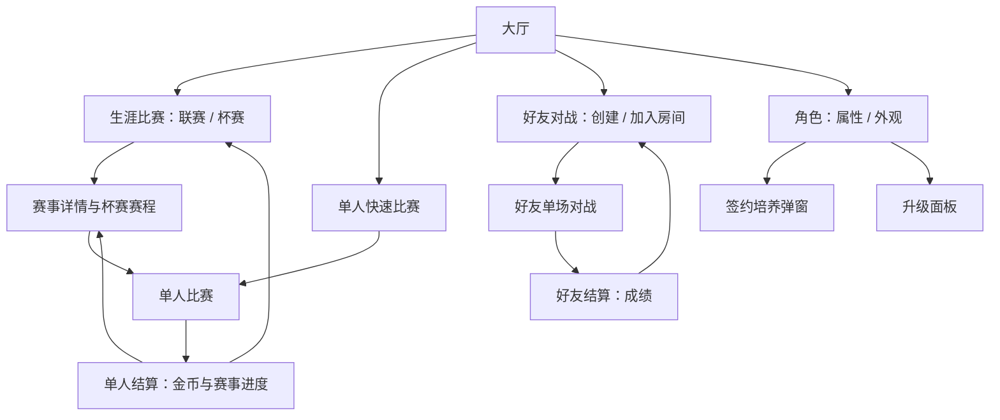

> 当前生效范围（2026-09-13）：所有角色免费使用，直接金币升级，不需要签约。签约卡、万能签约卡、染色剂及掉落仅为设计草案，未接入库存、奖励、消费和界面。下文涉及签约／道具的内容仅供后续设计参考，当前规则见[道具配置草案](道具与杯赛掉落配置.zh.md)。

# 大厅与赛事二级界面设计

更新时间：2026-09-13。状态：信息架构与交互方案，非美术定稿；已用临时功能面板接入核心流程，范围见 [原型接入记录](赛制养成原型接入记录.zh.md)。

规则唯一入口见 [赛制、奖励与角色培养](赛制奖励与角色培养设计.zh.md)。本文不另立经济参数，出现的金额为该方案中的演示值。

## 1. 设计目标与依据

大厅让玩家一眼回答：我用谁、下一场玩什么、打完能得到什么。长规则、所有杯赛和完整养成属性移到二级页面，不在大厅同时堆六个段位和多种奖励。

现有 `PrepareRaceFlow.ts` 已管理大厅/角色页、角色预览、属性/外观页签和模式卡片，应复用角色与资源表达，将新增赛事逻辑拆给独立页面与数据服务。

沿用仓库 UI 技能中的蓝青色、浅色卡片、深蓝文字、黄绿主按钮，以及已有背景、头像、金币图标和角色预览。新页面设计画布 1290×720 横屏；既有主 PSD 按实际尺寸维护，不强行缩放重做。

技能引用的 `docs/design/界面制作规范.zh.md` 本次检索未找到。此稿依据可读取的 `design-and-state-review.zh.md` 与 `cocos-prefab-notes.md`，不声称已核对缺失规范或 PSD。后续正式美术制作前需补齐规范来源并核对当前主稿。

## 2. 页面树



生涯页和快速比赛页是大厅二级页；赛事详情/赛程可作为生涯页内面板替换，不必再叠一整层导航。签约和规则说明用轻弹窗，避免弹窗套弹窗。

每个角色最多保留一个进行中杯赛。大厅显示账号联赛进度和当前角色的杯赛进度；切换角色只切换角色相关信息，联赛级别与积分不变。不自动报名、不自动替玩家消耗免费签约名额。

## 3. 大厅布局

以下为结构线框，非像素定稿。核心内容遵循安全区，超宽屏扩展背景与边距，不拉伸角色和卡片。

```text
┌──────────────────────────────────────────────────────────────┐
│ 头像 昵称      生涯：俱乐部选手             金币 8,420   设置 │
├───────────────────────────┬──────────────────────────────────┤
│                           │ 生涯比赛                         │
│       当前角色 3D         │ 俱乐部选手 · 积分 60/100          │
│                           │ 下一场：200 米 · 约1分多钟        │
│                           │ 赢取金币，冲击晋级杯              │
│  蛙妹  Lv.5 · 已签约      │               [ 进入生涯 ]       │
│  角色特性简述             ├────────────────┬─────────────────┤
│  [更换角色] [培养]        │ 快速比赛       │ 好友对战        │
│                           │ 200/400米      │ 和朋友比一场    │
│                           │ 单人 · 有金币  │ 联机 · 无奖励   │
└───────────────────────────┴────────────────┴─────────────────┘
```

建议顶部信息约占高度 12%，主体两列约 43%/57%，主赛事卡占右栏约三分之二高度；按美术主稿及最长文案再调，不把这些比例当硬编码尺寸。

大厅不再放三个让玩家猜含义的难度卡。入口按玩家目的命名，距离和规则在下一页明确选择。

### 3.1 主卡状态

| 状态 | 主卡内容 | 主按钮 | 点击结果 |
| --- | --- | --- | --- |
| 首次游玩 | 先游一场，体验角色 | 开始体验 | 进入单人快速准备，默认200米狂野规则 |
| 已完成首次体验 | 生涯级别、积分、下一场距离 | 进入生涯 | 生涯联赛页 |
| 满积分待晋级 | 晋级杯已开放、两轮/三轮、可分轮完成 | 挑战晋级杯 | 杯赛详情，不直接报名 |
| 杯赛进行中 | 杯赛名、当前轮/总轮、下一轮距离 | 继续杯赛 | 当前赛程面板 |
| 当前角色明显偏弱 | 账号联赛进度不变，可提示培养建议 | 进入生涯 | 固定难度照常，不因低等级补奖 |

进行中杯赛优先于待晋级提示。首次免费签约用角色区的小提示承接，不覆盖主比赛按钮。

### 3.2 不放进大厅的内容

全段位列表、AI 详细阵容、奖励完整公式、签约支付方式、属性逐项升级预览和所有规则说明进入二级页。首版不做满屏红点，金币足够升级不持续闪烁；免费签约可用/晋级杯新开放用一次性明确提示。

## 4. 生涯比赛二级页

顶部：返回大厅、标题“生涯比赛”、共享金币。内部只有“联赛”和“杯赛”两个页签，共用当前生涯身份。

### 4.1 联赛页签

- 左侧约 28%：六级生涯纵向列表，当前级别高亮、已通过可回打、未开放显示条件。
- 右侧约 72%：当前赛事说明、积分条、推荐角色等级、当前角色、规则/距离/时长、常规奖励说明。
- 底部唯一主要动作“开始联赛”；满积分时改为“查看晋级杯”。

示例文案：

> 俱乐部联赛 · 200米 · 狂野模式  
> 积分 60/100；前四名可获得联赛积分。  
> 满100分后挑战晋级杯，夺冠升入城市精英。  
> 推荐等级只作参考，所有角色都可挑战。

奖励写“完赛金币＋名次奖励＋表现奖励”，详情展开精确规则；不把理论最高奖励写成保证获得。回打低级赛事时显式提示“获得本级金币，不增加当前级别积分”。

底部展示小型当前角色摘要及“更换”。更换后回到原级别和页签，不重置滚动位置；账号联赛积分和晋级资格不变，不让新角色重打联赛进度。

### 4.2 杯赛页签

展示账号已开放的当前晋级杯及历史杯，不展示大量重复赛事卡。报名/轮次/夺冠状态取当前角色，开放资格取账号联赛进度。每张卡只给：名称、轮次距离、纯比赛预计时间、首次奖励状态、报名条件。角色通关标记与账号首次金币奖励标记分别展示，不能因换角色显示已领取奖励为可再次领取。

| 状态 | 卡片标识 | 操作 |
| --- | --- | --- |
| 积分不足 | 还需40积分 | 去参加联赛 |
| 可报名 | 两轮赛事，可分轮完成 | 查看赛程 |
| 进行中 | 决赛待开始，1/2轮已完成 | 继续杯赛 |
| 已首次夺冠 | 首次奖励已领取 | 再次挑战 |
| 高级杯未开放 | 晋级到对应级别开放 | 可看条件，不伪装成可报名 |

切换页签只更新相关内容，不重建 3D 角色预览，不重新请求同一份角色资产。

## 5. 杯赛详情与轮间页面

```text
返回生涯              俱乐部晋级杯                      金币

预赛 200米  ──────────────  决赛 200米
前四晋级                    第一名夺冠
已完成：第2名               下一轮

本届角色：蛙妹 Lv.5 [培养]       对手：杯赛预设固定难度
本轮奖励：常规比赛金币            首次夺冠额外：1,000
纯比赛约2～3分钟，可在轮间退出后继续

[稍后继续]                                      [开始决赛]
```

- 报名前主按钮“报名并开始预赛”；不收费，不另加无意义确认弹窗。
- 详情说明“这是蛙妹的杯赛进度，对手难度固定，轮间升级下一轮生效”。培养返回本页保留赛程，更新该角色最新等级，不提供接替本届选手的换人按钮。
- 每轮只突出下一轮，已完成轮显示真实名次；未打决赛不预授冠军图标。
- 轮间返回默认保存，不等于放弃；放弃入口放次级菜单，显示后果确认。
- 在大厅更换角色后，杯赛入口展示新角色自己的进度；切回蛙妹可继续她的决赛。“继续杯赛”带角色名和最新等级，升级不会提高杯赛对手难度。
- 同一个角色报名另一杯时提示该角色只能保留一届，允许返回原杯或明确放弃后报名；不影响其他角色的杯赛。
- 恢复中、服务不可用或结算未确认时禁用开赛并显示状态，不能当成新杯覆盖存档。

## 6. 单人快速比赛二级页

从上到下：

1. 距离：200米 / 400米，分别注明“一分多钟 / 约三分钟”。
2. 玩法规则：标准竞速 / 狂野，显示简短差异说明，沿用现有实际规则。
3. 只读说明：“对手将根据当前角色等级和联赛、杯赛表现自动匹配”。不设置难度选择器、推荐档按钮或手动覆盖入口。
4. 当前角色摘要，常规金币说明，“不增加生涯积分”；角色沿用大厅选择，需要更换时返回角色页，不增加第三组赛事选择。
5. 主按钮“开始比赛”。

本页只有距离与玩法规则两组可选项。记住上次选择，新玩家默认200米狂野规则。改变距离/规则仅局部更新选中态与说明，不切换角色、重载模型或重新播放预览动作。

AI适配读取当前角色的实际等级及已完成的联赛/杯赛成绩，按距离和规则选定阵容；没有赛事记录时采用保守的新手基线。角色在大厅更换或升级后，下次准备比赛重新估计。阵容在赛前锁定，赛中不追随玩家表现变难或变易。详细约束见规则文档第5.3节。

这是低等级新角色的安全入口，但不把失败后的玩家自动踢到这里；结算中可给次按钮建议。

## 7. 角色与培养二级页

沿用角色列表＋3D预览＋属性/外观结构。角色卡分离“已上场”“已签约”“等级”三种信息，正式可用但未签约的卡不能灰掉、上锁或无法选中。

| 角色状态 | 选择动作 | 培养区域 |
| --- | --- | --- |
| 未签约，免费名额可用 | 上场 / 已上场 | 免费签约培养 |
| 未签约，无免费名额 | 上场 / 已上场 | 签约培养；可免费使用，签约后可升级 |
| 已签约，未满级 | 上场 / 已上场 | 当前/下一级属性，升级价格 |
| 已签约，金币不足 | 上场 / 已上场 | 显示差额，去比赛赚金币 |
| 满级 | 上场 / 已上场 | 已满级，不显示升级支付 |

“上场”与“培养”始终独立，不能因为角色未签约就把上场按钮替换成视频按钮。已有上场角色按现有约定显示“已上场”。未发布的占位角色若保留，标“敬请期待”，与培养资格区分。

### 7.1 签约弹窗

标题：“签约培养 · 蛙妹”。正文：“角色可免费参赛。签约后永久开放金币升级，不会直接提升等级。”

- 免费资格可用：主要动作“使用免费名额”，明确仅一次且当前选择角色。
- 无免费资格：并列显示金币签约价格与“观看视频（0/3）”。
- 已完成1次视频：显示“视频进度1/3，剩余金币签约4,000”；两种方案可接续。
- 完成签约：局部切换为升级面板，不自动升级、不继续扣币。
- 视频失败：保留进度，提示“本次未完成，进度已保留”；不可用提示“视频暂不可用，稍后再试”。
- 支付/核验进行中：禁用相关提交按钮，重复输入不能重复交易；失败可恢复原状态。

免费首签属于持久选择，弹窗中展示角色名和说明后由玩家明确点击即可，无需再套一层确认。

### 7.2 升级面板

当前等级 → 下一等级；耐力、技巧、爆发按现有统一属性口径稳定列对齐。主按钮“升级 · 800金币”，不足时改显示差额与“去比赛”。未签约时不能调用升级交易。

“去比赛”优先返回原单人入口，若来自大厅/角色独立入口则去生涯推荐赛事；不能把赚金币引导导向好友对战。预览选中角色和已上场角色继续区分，返回时不误提交草稿选择。

## 8. 好友对战页面

复用现有创建/加入房间与成员卡，入口写“好友对战”，常驻短说明“朋友切磋，不获得金币和生涯积分”。

- 仅单场距离与已有规则，由房主设置；无杯赛报名、轮次、AI评级推荐、金币系数。
- 展示成员当前角色等级；默认沿用已有培养属性。统一等级友谊赛不在本次方案内。
- 房主开始/成员准备权限沿用现有规则，不因新增生涯页面改变。
- 返回大厅按现有退出流程，赛后“返回房间”维持保活会话，不混为退出。
- 进行中单人杯赛可暂存，好友对战结束后不影响该杯赛。

## 9. 结算页分流

| 来源 | 成绩外的信息 | 主动作 | 次动作 |
| --- | --- | --- | --- |
| 单人快速 | 金币明细 | 再来一场 | 返回快速比赛 |
| 生涯联赛 | 金币、积分变化、晋级资格 | 继续联赛 / 查看晋级杯 | 返回生涯 |
| 杯赛晋级轮 | 本轮金币、晋级结果、下一轮 | 查看下一轮 | 稍后继续 |
| 杯赛淘汰 | 本轮有效奖励、已保留累计金币 | 重新挑战 | 返回生涯 |
| 杯赛决赛 | 单场、名次额外、首次额外分项；生涯晋级 | 返回生涯 | 再次挑战 |
| 好友对战 | 仅名次、用时、本场表现 | 返回房间 | 按现有权限提供再来一场 |

金币显示“已到账/结算中”，不能展示未确认金额为已领取。“杯赛累计已获”是摘要，不再作为新奖励入账。失败正常有反馈，不把DNF显示成冠军，也不填造完赛时间。

好友结算不展示金币0、奖励占位空框、任务条、培养进度或激励视频。重赛入口受房主/成员权限与现有流程控制，成员不能单方面开始比赛。

## 10. 新手理解路径

1. 第一次大厅主要动作“开始体验”，200米、简单AI，不强制先签约。
2. 正常单人结算展示金币与“金币可用于签约和升级”。
3. 引导角色页说明“全部角色可用，首个培养名额免费”，允许先看角色或继续比赛。
4. 首签后展示一次升级差值及价格，让玩家理解签约和升级是两步。
5. 回大厅突出联赛积分；第一次积分满再解释晋级杯，不在第一屏讲完整六级赛程。

任何时候都可去好友对战，不以看广告、完成养成或生涯等级为前置。

## 11. 制作与运行时约束

- 复用既有背景、按钮底图、图标与角色卡；缺失美术资产在定稿后列清单再制作，不把本线框当正式图片。
- 文字保持 Cocos Label，静态正文用 ShuiMaster UI Regular，标题/按钮/关键值用 SemiBold；不把签约价格或按钮文案烘焙进底图。
- 所有常驻控件按页面挂载构建一次，切换选项只改旧/新控件；隐藏页没有比赛逐帧工作。
- 当前角色预览只因角色资源身份改变重建，页签/金币/难度变化不重启模型动作和旋转。
- 金币和状态事件更新，比较显示值后写 Label/active/interactable；不开每帧轮询格式化。
- 宽窄横屏和微信安全区分别校验，文字换行/长昵称截断不得挤掉主操作。逻辑热区不小于项目现有主要按钮标准。
- 数据加载中、断线、广告不可用、金币不足、满级、杯赛恢复中均有明确状态；关闭页面后旧异步回调不得覆盖新页面。
- 新功能拆为生涯页、杯赛面板、快速准备、培养交易面板，避免继续堆入 `PrepareRaceFlow` 或 `GameManager`。
- 实际接入后按项目要求进行字体、纹理、TypeScript审计与真机验收；本次纯文档不生成字库，不修改运行时资源，不启动Creator。

## 12. 验收场景

- 新玩家能说清“角色免费用、签约才能升级”，无需阅读长规则。
- 能区分“单人有成长奖励”和“好友只切磋”，好友入口不会被用作赚金币引导。
- 从大厅到常规比赛最多经过一张准备页；杯赛经详情明确规则后报名。
- 单人杯赛游完预赛退出，回大厅看到正确的继续入口，当前轮次和已发金币正确。
- 换角色后账号联赛进度不变，杯赛进度按角色切换，不能接替原角色；切回可续赛，升级后使用该角色最新属性，预设对手难度不变。
- 积分不足/刚满/晋级成功/最高级/回打低级的按钮与文案都正确。
- 切换角色、距离、规则和页签反复操作，节点与监听稳定、回调一次、预览不断播。
- 快速比赛只有200/400米与标准/狂野两组选择，自动匹配说明可读，无手动难度入口；更换角色或赛事成绩变化后的下一场正确读取适配输入。
- 0/1/2/3次视频与金币不足/足够组合显示正确，签约后仍需另付升级金币。
- 联机比赛及重赛完全没有奖励或生涯状态写入，房间保活流程不变。

后续制作顺序：先核对大厅与生涯页信息结构 → 完成角色签约状态稿 → 杯赛与两类结算状态稿 → 复用资产清单 → 运行时接入。无需一开始制作全部六级赛事的独立美术皮肤。

## 13. 当前功能原型的页面落地

联赛、杯赛和快速比赛均使用独立整屏二级页，不能将详情挤入大厅右侧栏。大厅右侧只做入口与摘要。进入赛事页隐藏大厅内容与角色预览，左上角返回恢复大厅。

联赛二级页上部为六级横向晋级路线，中部左侧显示选中级别、固定难度与账号积分，右侧显示积分获取和晋级步骤，底部提供开赛或进入晋级杯。未开放级别可查看，不可参赛。

杯赛二级页上部选择杯赛，中部以两张或三张流程卡展示各轮距离、晋级名次和当前状态，下部说明角色归属、轮间养成与奖励，底部提供继续本轮或报名；放弃本届需要二次点击。完整流程与主操作在一屏内可见。

当前采用简单静态色块和可编辑Label，仅作功能原型；后续美术替换保留该页面结构与交互，不回退为右侧嵌入详情。

大厅赛事入口统一为「生涯比赛」「快速比赛」「好友对战」。生涯比赛默认进入联赛页，通过页签切换角色杯赛；切换至杯赛时优先展示当前角色进行中的杯赛。大厅不再单列联赛与杯赛按钮。

大厅布局修正：原三张滑动赛制卡片区域整体替换为一个生涯比赛入口及进度摘要；下方原有黄色主按钮作为快速比赛入口，原有联机按钮进入好友房间。生涯面板内部不重复放置快速比赛或好友入口，原按钮素材、位置和交互动效保留。

## 14. 当前生涯地图交互（替代此前联赛/杯赛双页签方案）

生涯界面只有一张纵向滚动地图，每级联赛作为该级入口节点。默认选中并滚动定位账号最高已解锁联赛；点击其他节点，详情面板移动到该节点旁，滚动时面板与节点一起移动。保留「定位当前联赛」按钮，返回页面重新定位当前联赛。

选中节点的面板仅展示本级联赛积分/100、开始联赛按钮、对应角色杯赛名称与各轮距离/晋级状态、杯赛按钮。当前联赛满100积分启用杯赛；已通过级别允许回打，已开始杯赛可继续。未解锁节点允许查看，参赛按钮禁用。联赛与杯赛按钮独立，积分满后仍可选择打联赛。

不向玩家提前展示金币区间、对手等级或难度，相关数值保留在CareerRules和ProgressionBalance供开发调配。杯赛已过轮次、待赛轮次、失败与夺冠状态直接在地图详情中查看，不再切换页签。快速比赛及好友按钮沿用既有入口。
