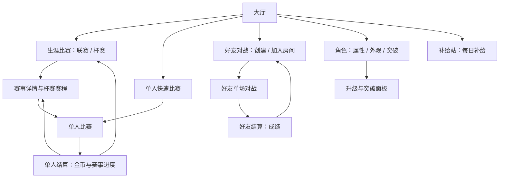
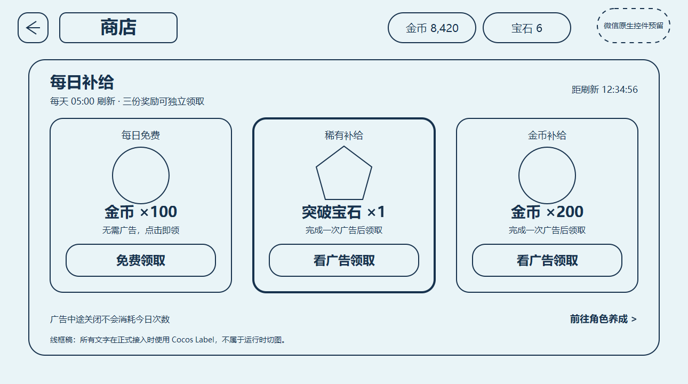

> 当前实现（2026-09-18）：所有角色免费使用；普通升级消耗金币，五次阶段突破额外消耗突破宝石。每日补给商店、双货币顶栏、杯赛首冠宝石和角色突破已接入运行时，等待编辑器与真机视觉验收。签约卡、万能签约卡、染色剂及随机掉落继续停用。

# 大厅与赛事二级界面设计

更新时间：2026-09-18。状态：赛事页已有临时功能原型；商店首版已按定稿接入运行时，资源与字体检查通过，仍需微信／抖音真机验收。

规则唯一入口见 [赛制、奖励与角色培养](赛制奖励与角色培养设计.zh.md)。本文不另立经济参数；为展示界面而重复出现的奖励数值必须与规则文档同步。

## 1. 设计目标与依据

大厅让玩家一眼回答：我用谁、下一场玩什么、打完能得到什么。长规则、所有杯赛和完整养成属性移到二级页面，不在大厅同时堆六个段位和多种奖励。

现有 `PrepareRaceFlow.ts` 已管理大厅/角色页、角色预览、属性/外观页签和模式卡片，应复用角色与资源表达，将新增赛事逻辑拆给独立页面与数据服务。

沿用仓库 UI 技能中的蓝青色、浅色卡片、深蓝文字、黄绿主按钮，以及已有背景、头像、金币图标和角色预览。新页面设计画布 1290×720 横屏；既有主 PSD 按实际尺寸维护，不强行缩放重做。

技能引用的 `docs/design/界面制作规范.zh.md` 本次检索未找到。此稿依据可读取的 `design-and-state-review.zh.md` 与 `cocos-prefab-notes.md`，不声称已核对缺失规范或 PSD。后续正式美术制作前需补齐规范来源并核对当前主稿。

## 2. 页面树



生涯页、快速比赛页和补给站都是大厅整屏二级页；赛事详情/赛程可作为生涯页内面板替换，不必再叠一整层导航。突破说明使用角色页内面板，不另套多层弹窗。

每个角色最多保留一个进行中杯赛。大厅显示账号联赛进度和当前角色的杯赛进度；切换角色只切换角色相关信息，联赛级别与积分不变。不自动报名、不自动替玩家消耗突破宝石。

## 3. 大厅布局

以下为结构线框，非像素定稿。核心内容遵循安全区，超宽屏扩展背景与边距，不拉伸角色和卡片。

```text
┌──────────────────────────────────────────────────────────────┐
│ 头像 昵称      生涯：俱乐部选手       金币 8,420  宝石 6  设置 │
├───────────────────────────┬──────────────────────────────────┤
│                           │ 生涯比赛                         │
│       当前角色 3D         │ 俱乐部选手 · 积分 60/100          │
│                           │ 下一场：200 米 · 约1分多钟        │
│                           │ 赢取金币，冲击晋级杯              │
│  蛙妹  Lv.5 · 待突破      │               [ 进入生涯 ]       │
│  角色特性简述             ├────────────────┬─────────────────┤
│  [更换角色] [培养]        │ 快速比赛       │ 好友对战        │
│                           │ 200/400米      │ 和朋友比一场    │
│                           │ 单人 · 有金币  │ 联机 · 无奖励   │
└───────────────────────────┴────────────────┴─────────────────┘
```

建议顶部信息约占高度 12%，主体两列约 43%/57%，主赛事卡占右栏约三分之二高度；按美术主稿及最长文案再调，不把这些比例当硬编码尺寸。

大厅不再放三个让玩家猜含义的难度卡。入口按玩家目的命名，距离和规则在下一页明确选择。

### 3.1 主卡状态

| 状态 | 主卡内容 | 主按钮 | 点击结果 |
| --- | --- | --- | --- |
| 首次游玩 | 先游一场，体验角色 | 开始体验 | 进入单人快速准备，默认200米狂野规则 |
| 已完成首次体验 | 生涯级别、积分、下一场距离 | 进入生涯 | 生涯联赛页 |
| 满积分待晋级 | 晋级杯已开放、两轮/三轮、可分轮完成 | 挑战晋级杯 | 杯赛详情，不直接报名 |
| 杯赛进行中 | 杯赛名、当前轮/总轮、下一轮距离 | 继续杯赛 | 当前赛程面板 |
| 当前角色明显偏弱 | 账号联赛进度不变，可提示培养建议 | 进入生涯 | 固定难度照常，不因低等级补奖 |

进行中杯赛优先于待晋级提示。角色达到突破门槛时，可在角色区显示一次“可突破”提示，不覆盖主比赛按钮。

### 3.2 不放进大厅的内容

全段位列表、AI 详细阵容、奖励完整公式、突破支付明细、属性逐项升级预览和所有规则说明进入二级页。首版不做满屏红点，金币或宝石足够升级不持续闪烁；只有“每日免费金币尚未领取”在顶栏补给箱入口显示一个红点，两个广告奖励不制造红点催促。

## 4. 生涯比赛二级页

顶部：返回大厅、标题“生涯比赛”、共享金币与突破宝石。内部只有“联赛”和“杯赛”两个页签，共用当前生涯身份。

### 4.1 联赛页签

- 左侧约 28%：六级生涯纵向列表，当前级别高亮、已通过可回打、未开放显示条件。
- 右侧约 72%：当前赛事说明、积分条、推荐角色等级、当前角色、规则/距离/时长、常规奖励说明。
- 底部唯一主要动作“开始联赛”；满积分时改为“查看晋级杯”。

示例文案：

> 俱乐部联赛 · 200米 · 狂野模式  
> 积分 60/100；前四名可获得联赛积分。  
> 满100分后挑战晋级杯，夺冠升入城市精英。  
> 推荐等级只作参考，所有角色都可挑战。

奖励写“完赛金币＋名次奖励＋表现奖励”，详情展开精确规则；不把理论最高奖励写成保证获得。回打低级赛事时显式提示“获得本级金币，不增加当前级别积分”。

底部展示小型当前角色摘要及“更换”。更换后回到原级别和页签，不重置滚动位置；账号联赛积分和晋级资格不变，不让新角色重打联赛进度。

### 4.2 杯赛页签

展示账号已开放的当前晋级杯及历史杯，不展示大量重复赛事卡。报名/轮次/夺冠状态取当前角色，开放资格取账号联赛进度。每张卡只给：名称、轮次距离、纯比赛预计时间、该角色首冠宝石状态、报名条件。首冠记录按角色与杯赛级别分别展示，切换角色后读取新角色自己的状态。

| 状态 | 卡片标识 | 操作 |
| --- | --- | --- |
| 积分不足 | 还需40积分 | 去参加联赛 |
| 可报名 | 两轮赛事，可分轮完成 | 查看赛程 |
| 进行中 | 决赛待开始，1/2轮已完成 | 继续杯赛 |
| 已首次夺冠 | 该角色首冠宝石已领取 | 再次挑战 |
| 高级杯未开放 | 晋级到对应级别开放 | 可看条件，不伪装成可报名 |

切换页签只更新相关内容，不重建 3D 角色预览，不重新请求同一份角色资产。

## 5. 杯赛详情与轮间页面

```text
返回生涯              俱乐部晋级杯                      金币

预赛 200米  ──────────────  决赛 200米
前四晋级                    第一名夺冠
已完成：第2名               下一轮

本届角色：蛙妹 Lv.5 [培养]       对手：杯赛预设固定难度
冠军奖励：本级冠军金币            该角色首冠额外：1突破宝石
纯比赛约2～3分钟，可在轮间退出后继续

[稍后继续]                                      [开始决赛]
```

- 报名前主按钮“报名并开始预赛”；不收费，不另加无意义确认弹窗。
- 详情说明“这是蛙妹的杯赛进度，对手难度固定，轮间升级下一轮生效”。培养返回本页保留赛程，更新该角色最新等级，不提供接替本届选手的换人按钮。
- 每轮只突出下一轮，已完成轮显示真实名次；未打决赛不预授冠军图标。
- 轮间返回默认保存，不等于放弃；放弃入口放次级菜单，显示后果确认。
- 在大厅更换角色后，杯赛入口展示新角色自己的进度；切回蛙妹可继续她的决赛。“继续杯赛”带角色名和最新等级，升级不会提高杯赛对手难度。
- 同一个角色报名另一杯时提示该角色只能保留一届，允许返回原杯或明确放弃后报名；不影响其他角色的杯赛。
- 恢复中、服务不可用或结算未确认时禁用开赛并显示状态，不能当成新杯覆盖存档。

## 6. 单人快速比赛二级页

从上到下：

1. 距离：200米 / 400米，分别注明“一分多钟 / 约三分钟”。
2. 玩法规则：标准竞速 / 狂野模式 / 娱乐模式，在右栏按一行一个模式纵向排列三张等宽卡片；说明依次为“专注节奏”“自由竞速”“随机事件”。娱乐模式支持 200 米短局与 400 米长局，长局使用五至六个事件和扩展波次。
3. 只读说明：“对手将根据当前角色等级和联赛、杯赛表现自动匹配”。不设置难度选择器、推荐档按钮或手动覆盖入口。
4. 当前角色摘要，常规金币说明，“不增加生涯积分”；角色沿用大厅选择，需要更换时返回角色页，不增加第三组赛事选择。
5. 主按钮“开始比赛”。

本页只有距离与玩法规则两组可选项。记住上次选择，新玩家默认200米狂野规则。改变距离/规则仅局部更新选中态与说明，不切换角色、重载模型或重新播放预览动作。

AI适配读取当前角色的实际等级及已完成的联赛/杯赛成绩，按距离和规则选定阵容；没有赛事记录时采用保守的新手基线。角色在大厅更换或升级后，下次准备比赛重新估计。阵容在赛前锁定，赛中不追随玩家表现变难或变易。详细约束见规则文档第5.3节。

这是低等级新角色的安全入口，但不把失败后的玩家自动踢到这里；结算中可给次按钮建议。

## 7. 角色与培养二级页

沿用角色列表＋3D预览＋属性/外观结构。角色卡分离“已上场”“等级”“可突破”三种信息；所有正式可用角色都能直接选择和升级，不显示签约、广告解锁或角色锁。

| 角色状态 | 选择动作 | 培养区域 |
| --- | --- | --- |
| 普通等级，金币足够 | 上场 / 已上场 | 当前/下一级属性；升级金币价格 |
| 普通等级，金币不足 | 上场 / 已上场 | 金币差额；去比赛赚金币 |
| 5／10／15／20／25 级 | 上场 / 已上场 | 突破；同时展示金币和宝石价格 |
| 突破资源不足 | 上场 / 已上场 | 分别显示金币/宝石差额；去比赛或去商店 |
| 10／20／30 级强化节点 | 上场 / 已上场 | 机制强化 I／II／III 展示位 |
| 30 级 | 上场 / 已上场 | 已满级，不显示升级支付 |

“上场”与“培养”始终独立。已有上场角色按现有约定显示“已上场”；未发布的占位角色若保留，标“敬请期待”，不能与突破状态混淆。

### 7.1 普通升级与突破

普通升级显示当前等级 → 下一等级、三项属性差值和金币价格。突破等级沿用同一面板，不另开多层弹窗：标题改为“阶段突破”，主按钮显示例如“2,500金币＋1宝石”，点击后一次完成扣费与 5→6 升级。

- 金币或宝石任一不足时主按钮不可提交，并在对应资源旁显示差额。
- 宝石不足的次级动作“去商店”返回时保持当前角色、页签、模型旋转和升级面板位置。
- 金币不足的“去比赛”优先返回原单人入口；若来自大厅/角色独立入口则去生涯推荐赛事，不能导向好友对战。
- 交易中只禁用本次提交和相关导航；重复点击不重复扣费。失败恢复原状态，权威成功后只更新等级、属性、两种余额、按钮和强化节点，不重建角色预览。
- 10／20／30 级的强化文案从角色配置读取；本轮只预留结构，不填写 11 名角色的具体效果。

## 8. 补给站与每日补给页

补给站使用大厅顶栏的独立补给箱图标，不占用底部比赛操作区。顶栏从左到右排列为“补给箱、金币、突破宝石、设置、平台原生胶囊安全区”；金币和突破宝石胶囊只显示图标与余额，不显示加号，但仍可作为补给站快捷入口。只有每日免费金币未领取时，补给箱右上角显示一个红点；两个广告奖励与货币胶囊都不额外显示红点。

首版补给站只显示“每日补给”，不创建空的推荐、道具或外观页签。补给站是与角色选择／培养同级的全屏二级页面：复用角色页背景、斜切标题底图、美术返回箭头和独立大触控区，不使用程序矩形返回按钮，也不在三张奖励卡外再包一层中央大面板。进入补给站时隐藏大厅 3D 角色预览和顶栏补给站入口，保留金币、突破宝石与设置；返回时恢复原大厅选择、顶栏入口和预览状态。资源到账只局部更新顶栏余额、对应卡片和红点，不重建页面或模型。

### 8.1 1290×720 定稿布局




可编辑源稿为 `art/shop-design/shop-daily-supply-wireframe.svg` 与 `art/shop-design/shop-daily-supply-final.svg`；PNG 仅用于评审，不作为运行时整页贴图。所有按钮文案、金额、倒计时和状态提示在正式接入时都必须是 Cocos `Label`。

| 区域 | 设计坐标与尺寸 | 说明 |
| --- | --- | --- |
| 返回按钮 | 美术 61×40，中心约 x=58, y=39；触控区 76×60 | 直接复用角色页返回箭头；无“返回”文字、无程序方块 |
| 标题区 | 左上 497×111 | 直接复用角色页白色／薄荷绿斜切标题底图；标题“补给站”使用 SemiBold 运行时 Label |
| 补给箱入口 | 右侧安全边界向左布局，约 82×90 | C 方案悬浮图标：深蓝补给箱、白色外轮廓、黄绿点缀，不加卡片或圆章；主界面下部运行时文字为“每日补给”，进入后的页面标题仍为“补给站”，免费金币可领时显示独立红点 |
| 金币胶囊 | 补给箱右侧，176×56 | 只显示金币图标与余额，无加号；点击进入/停留补给站 |
| 宝石胶囊 | 金币右侧，176×56 | 与金币胶囊等高；只显示宝石图标与余额，无加号 |
| 设置按钮 | 宝石右侧，约 82×90 | 与补给箱使用相同尺寸、深蓝主体、白色外轮廓和黄绿点缀，下部运行时文字为“设置”；不加卡片或圆章，是游戏自有控件中最靠右的一项 |
| 原生控件预留 | 设置右侧至屏幕边缘 | 按运行时平台安全区动态扩大，不放主要信息与点击目标 |
| 每日补给标题 | 左侧 x≈177, y≈136 | 使用角色页半调圆点装饰与深蓝 SemiBold 标题 |
| 三张奖励卡 | 中心 x=320／640／960，y≈389，292×330 | 直接排列在页面上，无外层主板；白色／浅青底、深蓝描边，宝石卡仅增加青色强调 |
| 卡片主按钮 | 卡内 x=30, y=236, 280×60 | “领取”或“看广告领取”；文字独立。已领取时切换专用蓝灰底图，不在绿色按钮上乘灰 |

三张卡的标题和奖励文字统一使用深蓝色；宝石卡不放大，只通过青色描边、圆点纹理和宝石图标形成稀缺感。卡片不再重复显示领取方式的灰色说明，获取方式由按钮直接表达。页面底部保留每日刷新时间和倒计时。

### 8.2 卡片状态

| 状态 | 按钮/文案 | 是否可点 | 处理 |
| --- | --- | --- | --- |
| 可领取 | 领取／看广告领取 | 是 | 锁定本卡提交；广告卡启动对应一次广告 |
| 广告加载中 | 视频加载中… | 否 | 只更新当前卡；不占次数 |
| 广告观看中 | 正在播放 | 否 | 防止并行拉起第二个广告 |
| 奖励结算中 | 奖励到账中… | 否 | 使用本次事务 ID 请求后台 |
| 已领取 | 已领取 | 否 | 切换专用蓝灰底图，隐藏视频图标并将文字居中 |
| 广告不可用 | 稍后重试 | 是 | 重新加载广告，不发奖、不占次数 |
| 已看完但结算失败 | 重试到账 | 是 | 复用完成凭据，不能再次播放广告 |

三张卡彼此独立，可任意顺序领取。页面打开期间跨过 05:00 时只触发一次新周期刷新；倒计时显示按秒更新，但只在最终字符串变化时写 Label，不做页面重建。

### 8.3 资产拆分

| 资产 | 处理 |
| --- | --- |
| 大厅背景、返回语言、黄色主按钮、金币图标 | 复用现有资源与造型；不复制同一金币图标 |
| 顶栏功能入口 | 补给站与设置采用 C 方案悬浮图标：无卡片、无圆章，统一为深蓝主体、白色外轮廓和黄绿点缀；名称使用带细白描边的运行时 Label，不烘焙进图片 |
| 无加号货币底板、通知红点 | 分别使用独立透明贴图；状态变化只切换红点显隐，不替换或重建整组控件 |
| 商店主板、普通奖励卡、宝石强调卡、刷新胶囊 | 从定稿源文件分别导出无字底图，支持九宫格或固定设计尺寸 |
| 突破宝石图标 | 新增独立透明图标；同时用于顶栏、商店、突破按钮和杯赛首冠奖励 |
| 视频图标 | 新增或复用单色独立图标，不与按钮文字烘焙 |
| 已领取按钮底图 | 基于绿色主按钮轮廓制作独立蓝灰状态图，保留斜切、压边和圆点；不使用运行时整体乘灰 |
| 红点 | 复用项目已有状态点优先；无合适资源时单独导出，不用运行时复杂绘制 |
| 文字、金额、倒计时、状态 | 全部由 Label 显示；正文 Regular，标题/按钮/关键值 SemiBold |

高保真稿中的渐变、柔光和卡片边缘已拆为 `assets/race/ui/shop-v1` 下的无字底图，没有使用多层运行时 `Graphics` 拼制。新增顶栏贴图已由 Creator 生成资源元数据，字体与纹理策略检查通过；微信／抖音真机仍需核对安全区、广告回调和透明边缘。

## 9. 好友对战页面

复用现有创建/加入房间与成员卡，入口写“好友对战”，常驻短说明“朋友切磋，不获得金币和生涯积分”。

- 仅单场距离与已有规则，由房主设置；无杯赛报名、轮次、AI评级推荐、金币系数。
- 展示成员当前角色等级；默认沿用已有培养属性。统一等级友谊赛不在本次方案内。
- 房主开始/成员准备权限沿用现有规则，不因新增生涯页面改变。
- 返回大厅按现有退出流程，赛后“返回房间”维持保活会话，不混为退出。
- 进行中单人杯赛可暂存，好友对战结束后不影响该杯赛。

## 10. 结算页分流

| 来源 | 成绩外的信息 | 主动作 | 次动作 |
| --- | --- | --- | --- |
| 单人快速 | 金币明细 | 再来一场 | 返回快速比赛 |
| 生涯联赛 | 金币、积分变化、晋级资格 | 继续联赛 / 查看晋级杯 | 返回生涯 |
| 杯赛晋级轮 | 本轮金币、晋级结果、下一轮 | 查看下一轮 | 稍后继续 |
| 杯赛淘汰 | 本轮有效奖励、已保留累计金币 | 重新挑战 | 返回生涯 |
| 杯赛决赛 | 冠军金币、该角色首冠宝石、生涯晋级 | 返回生涯 | 再次挑战 |
| 好友对战 | 仅名次、用时、本场表现 | 返回房间 | 按现有权限提供再来一场 |

金币和宝石分别显示“已到账/结算中”，不能展示未确认金额为已领取。“杯赛累计已获”是摘要，不再作为新奖励入账。失败正常有反馈，不把DNF显示成冠军，也不填造完赛时间。

好友结算不展示金币0、宝石0、奖励占位空框、任务条、培养进度或激励视频。重赛入口受房主/成员权限与现有流程控制，成员不能单方面开始比赛。

## 11. 新手理解路径

1. 第一次大厅主要动作“开始体验”，200米、简单AI，不强制进入商店。
2. 正常单人结算展示金币与“金币用于升级角色”。
3. 第一次到达 5 级时解释“突破需要金币＋宝石”，同时展示杯赛首冠和每日商店两条宝石来源。
4. 玩家可直接前往杯赛或商店；不弹出强制广告，不把宝石描述成必须付费获得。
5. 回大厅突出联赛积分；第一次积分满再解释晋级杯，不在第一屏讲完整六级赛程。

任何时候都可去好友对战，不以看广告、完成养成或生涯等级为前置。

## 12. 制作与运行时约束

- 复用既有背景、按钮底图、图标与角色卡；缺失美术资产在定稿后列清单再制作，不把本线框当正式图片。
- 文字保持 Cocos Label，静态正文用 ShuiMaster UI Regular，标题/按钮/关键值用 SemiBold；不把升级/突破价格、奖励数值或按钮文案烘焙进底图。
- 所有常驻控件按页面挂载构建一次，切换选项只改旧/新控件；隐藏页没有比赛逐帧工作。
- 当前角色预览只因角色资源身份改变重建，页签/金币/难度变化不重启模型动作和旋转。
- 金币、宝石、每日槽位和状态事件更新，比较显示值后写 Label/active/interactable；倒计时按秒采样且字符串不变不写，不开逐帧格式化。
- 宽窄横屏和微信安全区分别校验，文字换行/长昵称截断不得挤掉主操作。逻辑热区不小于项目现有主要按钮标准。
- 数据加载中、断线、广告不可用、金币/宝石不足、满级、杯赛恢复中均有明确状态；关闭页面后旧异步回调不得覆盖新页面。
- 新功能拆为生涯页、杯赛面板、快速准备、培养交易和每日商店服务，避免继续堆入 `PrepareRaceFlow` 或 `GameManager`。
- 实际接入后按项目要求进行字体、纹理、TypeScript 审计与真机验收；本次只增加设计文档和预览源稿，不生成字库、不修改运行时资源、不启动 Creator。

## 13. 验收场景

- 新玩家能说清“角色免费用、普通升级花金币、阶段突破还要宝石”，无需阅读长规则。
- 能区分“单人有成长奖励”和“好友只切磋”，好友入口不会被用作赚金币引导。
- 从大厅到常规比赛最多经过一张准备页；杯赛经详情明确规则后报名。
- 单人杯赛游完预赛退出，回大厅看到正确的继续入口，当前轮次和已发金币正确。
- 换角色后账号联赛进度不变，杯赛进度按角色切换，不能接替原角色；切回可续赛，升级后使用该角色最新属性，预设对手难度不变。
- 积分不足/刚满/晋级成功/最高级/回打低级的按钮与文案都正确。
- 切换角色、距离、规则和页签反复操作，节点与监听稳定、回调一次、预览不断播。
- 快速比赛只有200/400米与标准/狂野/娱乐三种规则选择，自动匹配说明可读，无手动难度入口；更换角色或赛事成绩变化后的下一场正确读取适配输入。
- 三个每日奖励任意领取顺序都正确；广告中断不消耗、广告完成但结算失败可直接重试到账。
- 5／10／15／20／25 级同时显示正确金币与宝石价格，任一不足不发生部分扣款。
- 商店重复进入、跨 05:00、冷/热字体缓存和 1152／1280／1290／1600×720 布局下，节点与监听稳定、文案不挤压原生控件安全区。
- 联机比赛及重赛完全没有奖励或生涯状态写入，房间保活流程不变。

后续接入顺序：双货币与迁移 → 杯赛首冠宝石 → 三槽每日服务 → 双货币顶栏与商店页 → 角色突破面板 → 字体/纹理/真机验收。无需为六级赛事制作独立商店皮肤。

## 14. 当前功能原型的页面落地

联赛、杯赛和快速比赛均使用独立整屏二级页，不能将详情挤入大厅右侧栏。大厅右侧只做入口与摘要。进入赛事页隐藏大厅内容与角色预览，左上角返回恢复大厅。

联赛二级页上部为六级横向晋级路线，中部左侧显示选中级别、固定难度与账号积分，右侧显示积分获取和晋级步骤，底部提供开赛或进入晋级杯。未开放级别可查看，不可参赛。

杯赛二级页上部选择杯赛，中部以两张或三张流程卡展示各轮距离、晋级名次和当前状态，下部说明角色归属、轮间养成与奖励，底部提供继续本轮或报名；放弃本届需要二次点击。完整流程与主操作在一屏内可见。

当前采用简单静态色块和可编辑Label，仅作功能原型；后续美术替换保留该页面结构与交互，不回退为右侧嵌入详情。

大厅赛事入口统一为「生涯比赛」「快速比赛」「好友对战」。生涯比赛默认进入联赛页，通过页签切换角色杯赛；切换至杯赛时优先展示当前角色进行中的杯赛。大厅不再单列联赛与杯赛按钮。

大厅布局修正：原三张滑动赛制卡片区域整体替换为一个生涯比赛入口及进度摘要；下方原有黄色主按钮作为快速比赛入口，原有联机按钮进入好友房间。生涯面板内部不重复放置快速比赛或好友入口，原按钮素材、位置和交互动效保留。

## 15. 当前生涯地图交互（替代此前联赛/杯赛双页签方案）

生涯界面只有一张纵向滚动地图，每级联赛作为该级入口节点。默认选中并滚动定位账号最高已解锁联赛；点击其他节点，详情面板移动到该节点旁，滚动时面板与节点一起移动。保留「定位当前联赛」按钮，返回页面重新定位当前联赛。

选中节点的面板仅展示本级联赛积分/100、开始联赛按钮、对应角色杯赛名称与各轮距离/晋级状态、杯赛按钮。当前联赛满100积分启用杯赛；已通过级别允许回打，已开始杯赛可继续。未解锁节点允许查看，参赛按钮禁用。联赛与杯赛按钮独立，积分满后仍可选择打联赛。

不向玩家提前展示金币区间、对手等级或难度，相关数值保留在CareerRules和ProgressionBalance供开发调配。杯赛已过轮次、待赛轮次、失败与夺冠状态直接在地图详情中查看，不再切换页签。快速比赛及好友按钮沿用既有入口。
