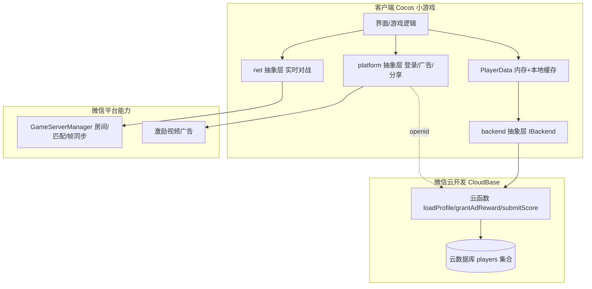

# 后端与养成体系架构（第一阶段：微信小游戏）

第一阶段范围：**只考虑微信小游戏**跑通「单机 + 好友实时对战 + 看广告得养成资源 + 每账号云端养成（换设备不丢）」。
本文是架构设计，面向不熟悉服务器开发的读者，尽量把「谁负责什么」讲清楚。

## 0. 结论速览

- 「换手机养成不能丢」= 养成数据必须存**云端、按微信账号（openid）存**。所以**需要一个后端**——但它是**无运维、按量计费、量小免费**的 Serverless，不是传统游戏服务器。
- 选型：**微信云开发（CloudBase）= 云函数 + 云数据库**。理由：云函数里能**自动拿到调用者的 openid**（微信帮你鉴权，连登录换 openid 都省了），天然「每账号一份数据」。
- 实时对战**不用自建服务器**：微信 `GameServerManager` 托管房间/匹配/帧转发（见 realtime-multiplayer-notes 第 7 节）。
- 看广告发奖：**发奖必须在服务端（云函数）做**，客户端只负责「播广告 + 告诉云函数我看完了」。否则金币可被本地改。

一句话架构：**微信托管实时对战 + CloudBase 云函数托管养成数据 + 客户端只做表现和调用**。你几乎不写「服务器」，只写几个云函数。

---

## 1. 为什么这次一定要后端

前面说过「实时对战不用自建服务器」，那是对的。但你新增了一条硬需求：

> 每个账号有自己的养成体系，换了手机打开游戏养成不能没了。

本地 `localStorage` 只在本机，换设备/重装就没了。要跨设备，数据必须放**云端**，并用一个**跨设备稳定的账号 ID** 索引——微信的 `openid` 正好是这个 ID（同一微信号在任何设备都一样）。

所以：**跨端存档 ⇒ 云端数据库 ⇒ 需要一个后端读写它**。这就是本阶段唯一真正需要后端的原因。

---

## 2. 选型：微信云开发（CloudBase）

微信官方的 Serverless 后端，专为小程序/小游戏设计。两个核心能力：

- **云函数**：跑在云端的 Node.js 函数，客户端用 `wx.cloud.callFunction({ name, data })` 调用。
  - **关键**：云函数里 `cloud.getWXContext().OPENID` 直接就是调用者的 openid，微信已鉴权。**不需要自己写登录换 openid 的服务**。
- **云数据库**：类 MongoDB 的文档数据库。云函数里用管理员权限读写（可信环境），客户端不直接改关键数据。

为什么选它（对比自己买服务器）：
| | CloudBase 云函数 | 自建服务器 |
|---|---|---|
| 运维 | 无（Serverless） | 要买、要运维、要扩容 |
| 账号鉴权 | 自动给 openid | 自己写 wx.login→code2session |
| 费用 | 按调用量，量小基本免费 | 固定月租 |
| 上手 | 写几个函数即可 | 要搭框架/数据库/部署 |

> 如果将来规模大、要复杂后端逻辑，可升级到「微信云托管（容器）」或自建，但第一阶段**云函数足够**。

---

## 2.5 先分清：微信托管数据 vs 自建云函数（重要）

微信除了帧同步，还托管了一部分「数据能力」，能进一步缩小你自建后端的范围。落地前先按「要不要防作弊」把数据分两类：

### 用微信 `RankManager`（得分存档服务，`wx.getRankManager()`）——零服务器、跨设备
- 能力：`update({scoreKey, score})` 上报，平台自动维护该用户各周期最高/最新分；`getScore({scoreKeys, periodType})` 查询（`periodType`：4=历史最高、1/2/3=日/周/月、5=最新）。
- 玩法 ID 在 MP 后台配，类型有**数值型 / 时间型 / 枚举型**。**游泳「最快完成时间」用「时间型」正好**。
- **适合**：排行榜、最快成绩、历史最高分、简单进度（如最高关卡）。这些**跨设备自动同步、完全免服务器**。
- **不适合**：养成货币/解锁——因为它是**客户端上报（可伪造）**，且只存单个数值，不防作弊。

### 用 CloudBase 云函数——需要防作弊 / 结构化的养成数据
- 金币、宝石、等级、解锁列表、每日限额等：客户端只发「意图」，云函数原子改值、返回权威结果。
- 这是唯一必须自建（但极轻）的部分。

> 分工一句话：**排行榜和成绩存档交给 `RankManager`（免服务器），养成货币交给 CloudBase 云函数（防作弊）。**

---

## 3. 整体架构



- **养成数据**：UI → PlayerData → backend → 云函数 → 云数据库。权威在云端。
- **实时对战**：UI → net → GameServerManager（微信托管，不碰你的云）。
- **广告**：UI → platform → 微信广告；看完后 → backend 云函数发奖（走上面那条线）。

---

## 4. 数据模型（云数据库 `players` 集合）

一条文档 = 一个微信账号，`_openid` 由云函数写入（不信客户端传的 id）：

```jsonc
{
  "_openid": "<微信 openid，账号唯一键>",
  "createdAt": 1234567890,
  "updatedAt": 1234567890,
  "schema": 1,                  // 结构版本号，便于将来迁移

  // 养成资源
  "coins": 0,
  "gems": 0,

  // 成长
  "level": 1,
  "exp": 0,

  // 解锁
  "unlocks": { "characters": ["default"], "skins": [] },

  // 战绩（可选）
  "stats": { "races": 0, "wins": 0, "bestTimeMs": 0 },

  // 每日限额（防刷广告）
  "daily": { "date": "2026-07-29", "adCount": 0 }
}
```

要点：
- **键是 openid**：同一微信号任何设备登录，云函数按 openid 取到同一条 → 换手机养成还在。
- **资源改动用「原子自增」**（云函数里 `db.inc(100)`），不接受客户端直接 `set coins=99999`。
- `schema` 版本号：字段以后会加，用它做兼容迁移。

---

## 5. 云函数清单（第一阶段最小集）

只要 3~4 个函数就够跑通：

| 云函数 | 作用 | 权威点 |
|---|---|---|
| `loadProfile` | 启动时拉取（或首次自动创建）本账号存档 | 读 openid → 查/建 players 文档 |
| `grantAdReward` | 看完广告发奖：校验每日上限 → 原子 +coins → 返回新余额 | **发奖在服务端**，防本地改 |
| `saveProgress` | 保存非敏感进度（如设置、关卡进度） | 白名单字段，拒绝敏感字段 |
| `submitScore`（可选） | 上报成绩 + 读排行榜 | 成绩校验、排行榜聚合 |

对局结算奖励（赢了给金币）也走 `grantAdReward` 同类思路：由**云函数**根据结果发，不由客户端自己加。

---

## 6. 看广告发奖：安全设计（重要）

分三层，安全性递增，第一阶段做到第 2 层即可：

1. **客户端**：`platform().showRewardedAd()` → `'completed'`（看完了）。
2. **服务端权威发奖（第一阶段用这个）**：客户端调 `grantAdReward` 云函数 → 云函数校验每日上限/冷却 → **原子自增** coins → 返回新余额。
   - 好处：金币余额是云端权威，本地改内存没用；有每日上限防刷。
   - 局限：云函数无法 100% 证明「真的看完了广告」（理论上有人能不看广告直接调函数）。对休闲游戏可接受。
3. **广告服务器回调（将来加固）**：微信「激励视频**服务器回调**」——用户真看完，微信带签名 POST 到你的一个 HTTP 云函数，你才在那时发奖。这是防作弊金标准，但配置多。**第一阶段先不做，留作升级项**。

流程（第一阶段）：
```
点"看广告得金币" → showRewardedAd() == 'completed'
        → callFunction('grantAdReward', { type: 'coins' })
        → 云函数: 查每日上限 → coins += N (原子) → 返回 { coins, adCount }
        → 客户端用返回值刷新 PlayerData/UI
```

---

## 7. 存档策略：云端权威 + 本地缓存

- **云端是唯一真相**（players 文档）。
- **本地 `localStorage` 只当缓存**：启动先用缓存把界面点亮（秒开），同时向云函数 `loadProfile` 拉最新，回来后覆盖本地。
- **写操作永远走云函数**：云函数返回权威结果 → 更新本地缓存。**不允许**客户端把整个存档 `set` 回云端（可作弊、会回滚）。
- 断网：能玩单机、用缓存显示；涉及资源变动的操作在联网后再提交（或直接置灰）。

---

## 8. 客户端模块划分（架构落到目录）

保持和现有 `platform/` 一样的「接口 + 实现 + mock」套路，游戏逻辑只认接口：

```
assets/scripts/
  platform/     (已建) 设备/SDK 能力：登录、广告、分享
  backend/      (待建) 云端养成数据
     IBackend.ts            接口：loadProfile / grantAdReward / saveProgress / submitScore
     WechatCloudBackend.ts  用 wx.cloud.callFunction 实现
     MockBackend.ts         编辑器/Web：用 localStorage 模拟，本地可调试
     PlayerData.ts          当前账号数据（内存 + 本地缓存），全局单例
  net/          (更后) 实时对战：INetRoom 接口 + WechatGameRoom(GameServerManager)
```

- **backend 与 platform 分开**：platform = 设备能力（wx.login/广告），backend = 你的云数据。都做成接口，便于将来抖音等平台各写一份实现。
- **PlayerData** 是养成的单一入口：`PlayerData.coins`、`PlayerData.addCoinsViaAd()`（内部调 backend）、`PlayerData.load()`。UI 只读它、只调它。

云函数代码本身（Node.js）不在 Cocos 工程里，放独立目录（如仓库根 `cloud/functions/`）用微信开发者工具/CLI 部署。

---

## 9. 实时对战（回顾，微信托管）

- 用 `wx.getGameServerManager()`：`login → startMatch/createRoom → startGame → uploadFrame/onSyncFrame`。
- 不碰你的 CloudBase；房间/匹配/帧转发/补帧全微信做。
- 确定性靠已完成的 `SharedRNG`（房主 broadcast seed，各端 reseed）。
- 详见 `docs/realtime-multiplayer-notes.zh.md` 第 7 节。
- 对局奖励最终仍通过 `grantAdReward`/结算云函数落到云端存档。

---

## 10. 第一阶段里程碑

1. **B1**：开通微信云开发；建 `players` 集合；写 `loadProfile` 云函数；客户端 `backend/` + `PlayerData` 骨架，启动能拉/建存档并显示金币。
2. **B2**：`grantAdReward` 云函数 + 界面「看广告得金币」按钮，跑通「看完→云端加币→刷新」，含每日上限。
3. **B3**：好友实时对战（net 层 + GameServerManager），2 人房跑通；对局结算奖励落云端。
4. **B4（加固，可选）**：激励视频服务器回调防作弊；排行榜；数据迁移（schema）。

---

## 11. 安全红线（哪些必须在服务端）

- **一切资源增减**（coins/gems/解锁/等级）→ 云函数权威，客户端只发「意图」。
- **账号身份**（openid）→ 云函数从上下文取，绝不信客户端传的 id。
- **每日/活动限额**→ 云函数校验。
- 客户端可以本地缓存、可以先行显示（乐观更新），但**真值以云函数返回为准**。
- 微信 appsecret、云资源密钥 → 只在云端，绝不进客户端包。
