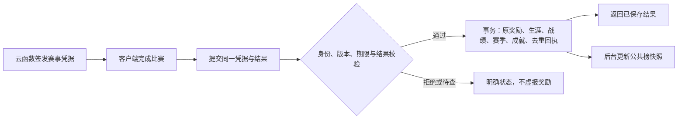

# 生涯、赛季、排行榜与成就设计

日期：2026-09-27。状态：**设计提案，未实施，待负责人审阅**。本文依据当前源码核对现状；所有新增名称、周期、门槛与奖励均为建议值，不代表已确认数值或已上线功能。本次只新增设计文档与导航，不更改客户端、云函数、数据库或线上配置。

> 2026-09-27 后续确认：排行榜先做快速比赛总榜，不限制角色/等级；养成榜是否更新完全由负责人手填版本号并启用控制，客户端/数值/Bug 更新均不得自动换榜。详见[快速比赛总榜与手动版本管理设计](快速比赛总榜与手动版本管理设计.zh.md)。本文赛季杯赛榜及统一属性周挑战仅保留为后续候选，不是当前排行榜的前置要求。

> 同日进一步确认：生涯也由负责人手动管理赛季版本，不同季可能完全不同。统一配置及数据归属以[统一版本配置与生涯赛季数据设计](统一版本配置与生涯赛季数据设计.zh.md)为准。下文六级路线、28 天、三角色认证等是单季内容候选；不再默认全季共用永久联赛进度，也不自动按日期创建新季。

## 1. 建议采用的整体方案

保留现在的六级生涯作为首季规则候选，账号角色培养跨季保留，形成三个目标：

- **账号养成与历史荣誉**：角色培养和已有赛季成果长期保留；各季赛事进度独立。
- **赛季挑战**：负责人指定并启用每季版本，使用该季规则和进度。28 天只作为内容时长建议，能否继承赛事资格由具体新季规则决定。
- **荣誉档案**：永久成就、角色奖杯、个人最佳与历届赛季记录，把“我玩出了什么”留下来。

当前优先设计微信全服「快速比赛总榜」，按同一距离与规则的最佳完赛时间排名，不限制角色和等级。下文「赛季杯赛榜」与统一属性「每周竞速挑战」是可选扩展，尚未决定实施，不影响负责人独立控制快速比赛榜的版本。

不新增可消费货币，不重置金币和等级，不恢复旧的签约/道具草案，不强迫每日签到，不把好友房改成排位赛。腾讯云继续承担数据存储、规则计算与查询，管理入口沿用腾讯云官方控制台。

### 1.1 玩家实际会怎么玩

| 玩家阶段 | 眼前目标 | 阶段目标 | 长期留下什么 |
|---|---|---|---|
| 新玩家 | 完成比赛，赚金币，选择主力 | 联赛积分满 100，拿第一座杯；完成赛季入门目标 | 永久联赛解锁、首次夺冠成就、首季记录 |
| 中期玩家 | 培养主力，挑战更高固定难度 | 用第二个喜欢的角色拿杯，提高本季荣誉分 | 角色独立奖杯、不同规则个人最佳 |
| 成熟玩家 | 直接挑战高阶杯，不重打新手晋级 | 三个角色争取高阶杯认证；后续挑战统一条件竞速 | 赛季奖章、历届排名、角色专精记录 |
| 偶尔回归 | 继续原杯赛或打一场快速比赛 | 挑选本季尚未完成的目标 | 已有养成和永久成就不丢失 |

## 2. 已实现内容核对

以下为当前代码事实，与后文建议区分。历史文档存在被后续修改覆盖的段落，以运行路径和规则代码为准。

| 系统 | 当前真实行为 | 对新设计的约束 |
|---|---|---|
| 账号与存档 | 微信使用云函数＋云数据库；公开短 ID 从 10000 分配；其他尚未接云的平台仍用本地模拟档 | 首版“全服”仅指同一正式环境的微信玩家，不含抖音、TapTap 和本地测试档 |
| 角色 | 11 个当前可用角色均可直接使用；固定能力不同 | 不能把角色不同的正常比赛时间称为纯操作比较 |
| 培养 | 金币直接升级，1～30 级，无独立经验值；没有签约前置 | 赛季不能默认重置养成，不能设计经验药或签约卡为已可发奖励 |
| 生涯联赛 | 泳馆新秀→俱乐部选手→城市精英→区域强者→全国大师→冠军级；账号共享联赛及积分 | 换角色不退段位，不自动匹配更弱的正式赛事 |
| 积分 | 当前级别联赛前四名加 20/14/10/6，其他名次为 0；100 封顶，不扣分 | 旧积分不是可无限累加的赛季分；回打低级联赛不加当前级积分 |
| 晋级 | 当前级积分满 100，任一角色赢下本级杯后账号升一级，积分归 0；最高级可重复挑战 | 永久解锁路径已有完整用途，不必为了赛季再造一遍 |
| 杯赛 | 每角色一届进行中的杯；前三档两轮 200 米，后三档为 200/200/400 米三轮；预赛前四、半决赛前三、决赛第一 | 杯赛战绩必须按角色及整届认定，不能只上传一次冠军名次 |
| 杯赛续赛 | 轮间进度保存，可升级该角色后继续；另一角色不能接替；淘汰重开 | 赛季归属需要绑定整届杯赛，不能换季后只打一轮补算整杯 |
| 比赛规则 | 生涯联赛与杯赛均为狂野；快速比赛可选 200/400 米、标准/狂野 | 标准模式也不能默认解释成“无碰撞计时赛” |
| AI | 六级正式赛事分档配置等级、智力、角色池；当前各档 7 个 AI。快速比赛按角色等级和联赛/杯赛经历适配 | 快速比赛的胜场和时间不能直接与固定赛事混排 |
| 比赛金币 | 联赛和快速比赛有常规金币；杯赛仅夺冠发 60/70/80/90/100/120 金币，预赛和半决赛不发 | 当前杯赛主要价值是晋级，不宜承诺其是主要刷金币入口 |
| 已有记录 | `career.wins` 记录角色赢过哪些档位，不记录重复夺冠次数；`receipts` 只留最近 32 条简要回执 | 不能用旧档倒推出总比赛数、每场用时或历季战绩 |
| 预留字段 | `firstPrizes`、签约相关字段、杯赛道具配置等有历史/预留内容；当前未形成道具奖励链 | “字段存在”不等于首奖、背包或道具系统可用 |
| 好友联机 | 好友单场玩法，不发金币、不推进单人生涯/任务/奖励型成就；房间保活重赛 | 本设计维持该边界；联机胜场不进入有奖励的公共榜 |
| 管理 | 已有查档、金币/等级调整、清待结算、撤销管理修改和审计 | 新增赛季、成就、榜单后，管理纠错必须能处理关联数据 |

### 2.1 现有玩法给予的设计机会

角色能力已经具有区别：蛙妹偏判定宽容，忍者哥偏精准推进，蛙少偏海豚跳，飞毛腿偏蹬墙，潜水哥和机甲不能海豚跳，风火轮强调连续 PERFECT。成就应鼓励体验这些差异，不能向所有角色派发同一种技能任务。

但当前云端结算只收到名次、用时、是否完赛、人数、PERFECT/GOOD/失误次数及最高连击。`maxCombo` 对应连续 PERFECT；GOOD/失误会打断。海豚跳次数、有效潜水穿越、碰撞次数、每段分速等没有进入可信的云端业务记录，首版不据此发奖。

### 2.2 云端能力与已验证范围

已有身份校验、版本冲突处理、事务写入、请求去重和客户端待发送恢复；可以扩展赛季与成就规则，不需要租用常驻游戏服务器。**云存档不会自动生成赛季、排名或反作弊，这些仍要开发云函数业务。**

当前有每账号一个未结算赛事、24 小时凭据有效期及设备写入约束。完整档案不可由客户端任意覆盖；新版数据必须有明确迁移流程，目前云端对不认识的 schema 会拒绝。

已完成真实账号基础云存档调用与短 ID 新包验证，不等于完整云端生涯、全赛季切换和并发榜单已经验收。排名与奖励上线前另做专项验证。基础成绩仍来自客户端，合理性检查不等于服务端模拟比赛。

## 3. 单季生涯与永久荣誉：保留成果，补充目标

### 3.1 保留哪些规则

首季可沿用六级路线、100 分晋级杯、固定 AI 难度、角色独立杯赛、轮间培养、失败不扣联赛分。金币、外观选择、角色等级属于账号；联赛解锁和角色通关记录保留在原季，下一季不默认复用。不同季如采用新规则，以统一版本设计完成隔离；好友房不因此改变。

### 3.2 增加角色奖杯册

每个角色显示六个杯赛徽记：未解锁、可挑战、进行中、已夺冠。首次夺冠永久点亮；再次夺冠计入新的生涯统计，但不重复提供永久首通奖励。

奖杯册提供“这个角色下一座杯”的建议，使用实际已解锁赛事与该角色战绩。不因为账号段位高，就把新角色所有杯当成已经完成。原有账号联赛解锁共享，不强迫每角色重新刷 100 联赛分。

最高级玩家的目标从“再次获得无处使用的联赛分”转向角色收集、赛季认证与个人纪录，不无故新增第七级或无限段位。

### 3.3 新增生涯统计

首版记录：有效完赛数、完赛距离、200/400 米完赛数、各模式完赛数、各角色完赛与冠军次数、杯赛夺冠次数、最高连续 PERFECT、累计 PERFECT、不同角色夺冠覆盖。

全部来自成功结算的赛事事件；一场比赛只记一次。距离按凭据中的 200/400 米及完赛状态计算，不用客户端自报累计游程。好友房、调试、无云凭据比赛不计这些奖励相关统计。未完赛可在近期战绩显示，但不增加完赛数或距离。

不公开“技术评分”“击败全国百分之多少”等缺乏样本和统一基线的数字。

## 4. 赛季设计

### 4.1 周期与参与

建议首轮内容按 **28 天**规划，但不自动换季。负责人手动填写并启用 `seasonVersion` 才选择新季；如配置结束时间，到期只关闭该季的新开赛资格，不自动生成/启用下一季。时间统一以北京时间展示，没有付费赛季通行证或体力门票。

赛季功能随正式云档开放，初始化时读取当前手动启用的赛季。新玩家可以先做该季入门目标；是否要求其他资格由新季配置明确。界面说明“角色养成保留，往季生涯保留历史，本季按新规则开始”。

| 数据 | 切季处理 |
|---|---|
| 金币、角色等级、选择与外观、玩家 ID | 保留 |
| 六级联赛解锁、当前 0～100 分 | 留在原季，新季按自己的规则初始化 |
| 角色奖杯、成就、累计统计 | 原季奖杯带季标签保留；跨季成就只汇总语义一致的事件 |
| 本季角色杯赛认证、荣誉分、本季目标 | 新季从 0 开始，旧季归档 |
| 赛季奖励领取状态 | 旧记录保留防重复，新季单独记录 |
| 进行中的杯赛 | 原季历史保留，已签发场次可按窗口结算，未开始后续轮次默认不续开 |
| 历届最高荣誉与最终名次 | 保留，展示当时赛季与规则版本 |

### 4.2 本季杯赛认证与荣誉分

复用现有杯赛：**在本季报名并完成全部轮次的有效夺冠**，为该角色取得一次本季认证。角色只能保留本季最高档位认证；低档到高档是替换，不是叠加。同一档重复夺冠不继续刷荣誉分。

账号取分值最高的 **3 个不同角色认证之和**，作为赛季荣誉分。最多统计三名，是为了让玩家有换角色目标，同时避免强迫培养全部 11 个角色。

| 夺冠档位 | 泳馆新秀 | 俱乐部选手 | 城市精英 | 区域强者 | 全国大师 | 冠军级 |
|---|---:|---:|---:|---:|---:|---:|
| 单角色认证分（建议） | 100 | 180 | 280 | 400 | 550 | 750 |

例如：蛙妹城市杯 280＋蛙少俱乐部杯 180＋猫姐泳馆杯 100＝560 分。蛙妹再拿城市杯仍是 560；蛙妹升到区域杯后变为 680。第四个角色拿全国杯 550，则采用 550＋400＋180＝1130，最低的 100 被替换。

上限为 2250。达到上限代表完成本季三角色最高档挑战；允许多人共同达成，不用无限重复场次制造高低。同分时不拿用时、早注册、先冲榜或金币数量作为隐藏胜负条件。

认证不占用联赛积分，不可消费，普通快速比赛不直接给认证分。原有杯赛冠军金币照常结算，不因有认证重复发一次比赛金币。

**取舍**：该榜会体现养成积累，高级账号更容易高分，因此名称和规则明确是杯赛挑战榜，不叫公平天梯。新玩家靠固定目标和个人奖章获得进展；公平竞速另见第 6 节。成熟玩家可能很快完成三角色挑战，首版不承诺凭这一个系统支撑整月内容。

### 4.3 赛季奖章

建议按荣誉分颁发：100 初露锋芒、400 逐浪新星、900 多面泳将、1500 泳池大师、2250 全能冠军。名称可在美术阶段调整。

每季记录已达到的最高奖章，规则内正常失败不会掉分。档案显示赛季编号和奖章；异常成绩被撤销时允许重算。首版奖章只有展示价值，不提升属性；称号佩戴、头像框、皮肤库存均属于额外功能，未实现前不承诺发放这些资产。

### 4.4 少量赛季目标，照顾新玩家

四项从赛季开始同时可见，不逐日解锁；同一场满足多个条件时可以同时推进。建议奖励总额每账号每季最多 **2000 金币**。

| 目标 | 明确条件 | 金币建议 |
|---|---|---:|
| 热身入水 | 本季有效单人完赛 3 场 | 200 |
| 长池适应 | 本季有效完成 3 场 400 米 | 400 |
| 换个泳姿性格 | 本季使用 3 个不同角色各有效完赛至少 1 场 | 600 |
| 本季第一杯 | 取得任意一个本季杯赛认证 | 800 |

前三项可由快速比赛、联赛或杯赛轮次完成；只需有合法凭据及有效完赛，未夺冠也有进展。最后一项必须符合整届赛季认证规则。好友房和调试不推进。

这是一组易理解的阶段补给，不是每日打卡任务，也不作为荣誉分来源。高手不能通过反复刷目标冲榜。完成即由云端一次性入账，界面按钮仅“查看奖励”，不额外做可能忘领的金币领取操作。

### 4.5 跨赛季比赛与杯赛

区分**一场比赛凭据**和**一届多轮杯赛**：

1. 每场凭据固定开赛时的赛季 ID、规则版本、签发时刻、失效时刻；不得由客户端自行选择赛季。
2. 整届杯赛额外固定报名赛季、杯赛配置版本、种子及各轮规则。当前实现需要扩展这些快照字段，不能把既有 `cup.seed` 当成全部配置已锁定。
3. 截止时刻后不再签发旧季计分凭据。已签发的单场允许在其有效期内补交，旧季预留 **24 小时结算宽限**；只使用云端签发/接收时间判定，不信任客户端声称的完赛日期。
4. 截止前已签发的决赛在宽限内有效夺冠，可以取得旧季认证。截止前只有预赛或半决赛凭据，已签发这一轮可结算，但未开始的后续轮次默认不再开放；原杯留作“赛季结束，未完成”历史。
5. 旧杯不会转移到新季；新季杯赛按新季规则重新报名。若要保留旧杯完整续赛，需要负责人另外确定关闭策略并保证旧规则/客户端仍支持。
6. 单场目标及整届认证均按该场/该届绑定的原季处理；不能旧杯的最后一轮直接发到新季。
7. 未结算、过期、被拒绝、放弃、淘汰、重复提交均不得伪造有效夺冠。宽限结束后旧季停止普通玩家写入，剩余异常通过带原因的管理纠错处理。

例：S1 停止新开赛前签发冠军杯决赛，负责人启用 S2 后断网恢复，6 小时后有效结算仍记 S1；如果 S1 只完成预赛而未签发下一轮，默认将旧杯作为未完成历史保留，不用 S2 规则继续解释它。

宽限期是网络恢复的折中，不是可靠的“玩家必定在截止前完赛”证明。没有可信实时完赛记录时，不能宣传这种严格公平性。

### 4.6 结季与回归

赛季状态：未开始→负责人启用→停止新开赛/宽限→复核→已归档。负责人可在上一季宽限期间手动启用下一季，数据按 `seasonVersion` 隔离，不由定时任务自动换号。

定时云函数分批冻结排名与奖章，保留进度游标、重复执行保护；失败可重跑，不在一个超长函数里处理全服。玩家登录时补建自己的新季状态，不要求切季瞬间改写所有主档。

赛季固定目标奖励在有效结算事务里自动发放；排名本身首版不发金币或属性奖励，结季无需全服批量发币。回归时只显示一次上季回顾，已发金额不能再次领取。不安排未领取就永久失去的金币。

## 5. 全服排行榜

### 5.1 后续候选：赛季杯赛榜

本节是此前提案，不是当前首版总榜规则。当前快速比赛榜不使用赛季积分或季末自动换榜，按上方专项设计执行。

| 项目 | 规则 |
|---|---|
| 范围 | 当前正式微信云环境；测试账号/测试环境排除；不宣称跨平台全服 |
| 上榜条件 | 至少一个有效本季杯赛认证，荣誉分大于 0，成绩未处于排除状态 |
| 排序 | 荣誉分降序；同分并列，名次采用 1、2、2、4 规则 |
| 展示 | 名次、游戏昵称、头像、公开短 ID、荣誉分、前三个计分角色及杯级 |
| 个人区 | 本人分数、认证构成、刷新时刻；无认证显示“完成一届杯赛后上榜” |
| 刷新 | 目标约 1～5 分钟更新公共快照；本人结算后的分数即时显示，排名标注待刷新 |
| 规模 | 首屏 20 条，分页最多查看前 100 条；名次来自同一快照 |
| 奖励 | 奖章按分数门槛获得，不按人数比例或名次发经济奖励 |

同分记录可按稳定内部键排列表格，**列表顺序不代表打破并列名次**。前 100 条边界有并列时提示“此处有同分玩家”，允许本人区显示自己的并列名次；不要只因未进入展示页就称“未上榜”。

全榜精确本人名次在小规模时可按索引统计严格高于本人的分数人数＋1；增长后由分页扫描生成带版本的排名快照。先验证腾讯云当前查询限制和费用，再承诺刷新频率。不对每次打开页面全表下载排序，也不要求赛中实时推送排名。

### 5.2 候选赛季杯赛榜不混入的内容

- 总金币：可花费、可管理补偿，不代表比赛能力。
- 累计场次：主要奖励在线时长，容易变成无限刷。
- 普通 200/400 米混合时间：距离不同；同距离下角色、等级、规则、AI 和随机碰撞也不同。
- 好友房胜率：目前无统一匹配强度，容易相互送分，且房主/本人权威不等于可信服务器裁判。
- 云端未确认或异常待查成绩：不先上榜后当作已验真。

成就总分可以在个人档案展示，首版不再做第二个全服成就榜，避免稀释人数和目标。

### 5.3 与微信平台榜单的关系

首版建议以现有云数据库作为成绩真源，云函数输出榜单摘要。微信关系链能力或 RankManager 将来可作为展示扩展，但不把其名称当作“现成支持全部自定义全服榜”的保证；此前调研未确认所需任意榜查询和运营改分能力。

不为此发布独立网站或配置域名。游戏内榜单是客户端功能；运营查看则使用现有腾讯云控制台。

## 6. 后续公平竞速：每周挑战

这是保留备查的新增玩法候选，**当前没有该入口或固定属性挑战凭据，负责人当前不要求养成公平性，也未授权推进此玩法**。它不属于快速比赛总榜首版范围。

### 6.1 建议赛制

每周一个 200 米标准规则挑战，指定同一个角色、固定 Lv.15、固定版本的数值与能力、AI 阵容、种子和玩家泳道。统一等级只作用本次比赛，不改玩家实际养成；所有玩家均可使用挑战角色。

首轮先验证 200 米，不同时拆出大量角色榜和 400 米榜。挑战中保留明确公开的现有碰撞与规则，不假装标准规则天然无碰撞。若后续要做无对手的纯计时赛，应独立设计与验证，不能直接用当前杯赛凭据冒充。

- 无限免费练习，榜单取本周最佳有效成绩；不额外按练习次数发金币。
- 时间统一取整数毫秒，越小越好；同毫秒并列。成绩单位和显示舍入统一，不能界面相同却暗用隐藏小数决定胜负。
- 如未来另行采用周挑战，需要单独确认其挑战周期与版本规则。不得将候选周挑战的周期或平衡变更用作自动切换当前快速比赛总榜的理由。
- 玩家个人最佳可立即显示“待校验”，公共榜只收通过当前审核策略的成绩。首次只给纪念记录，暂不发稀缺名次奖励。
- 每周挑战独立于普通 `quick` 来源，防止绕过固定配置；客户端不得选择自己的等级、种子或 AI。

固定配置和种子只减少差异，并不证明 iOS/Android 浮点与帧率结果完全一致。当前实时架构不是可跨引擎精确复算的服务器裁判，上线前需真机分布测试。不能承诺“上传输入就自动得到完全可信排名”。

### 6.2 开放前条件

若未来决定采用，再验证固定属性比赛与原养成隔离、挑战凭据/结算幂等、跨设备帧率与计时一致性、实测异常阈值及头部成绩审核、管理撤销与重算。此候选的开放条件不作为现阶段快速比赛总榜的前置要求。

## 7. 永久成就

### 7.1 规则

成就按账号永久保存，每一档只达成一次。赛季切换不清空，不做奖励日历。首版奖励为**成就点数＋档案徽记**，不是新货币，不兑换金币或属性；点数仅展示完成程度。

多档成就按各档独立累计点数，例如 5/10/20 表示完成三档累计 35 点。比赛结算时自动解锁，赛后合并提示，不要求逐项点领取。没有“分享给好友”“连续登录断一天重来”等任务。

以下“可复用”表示结算/云档已有基础输入，**仍需新增统计、达成判定和存储**，不是现有成就已上线。

### 7.2 首版候选清单

| 类别/成就 | 明确门槛（建议） | 点数 | 数据依据与边界 |
|---|---|---|---|
| 第一滴水花 | 首次有效单人完赛 | 5 | 完赛事件；旧回执不足以恢复完整时间，见迁移 |
| 泳池常客 | 有效完赛 10/50/200 场 | 5/10/20 | 新增累计计数，不拿回执长度当总场次 |
| 水路漫漫 | 有效完赛累计 2/10/50 千米 | 5/10/20 | 凭据距离求和，仅计算完整完赛 |
| 长池适应 | 400 米完赛 1/10/50 场 | 5/10/20 | 已有距离＋完赛输入 |
| 首次登顶 | 任意有效单人比赛冠军 1 次 | 5 | 名次第一且完赛，排除调试/好友 |
| 杯赛收藏家 | 杯赛夺冠 1/10/30 届 | 5/10/20 | 必须完成决赛和前置轮次；总次数上线起统计 |
| 生涯晋级 | 达到第 2/3/4/5/6 级联赛 | 每级 10 | 云端晋级；可依据旧 `career.league` 补认 |
| 角色第一杯 | 每个角色首次任意杯夺冠 | 每角色 5 | 可依据旧 `wins[characterId]` 补认，最多 11 项 |
| 三栖泳将 | 3/6/11 个不同角色各有永久杯赛夺冠 | 5/10/20 | 角色覆盖，而不是换装或昵称数量 |
| 一路拿杯 | 任一角色集齐六档永久奖杯 | 20 | 六个不同档位全部有记录；高阶杯不自动补低阶杯 |
| 稳定节奏 | 一场有效完赛最高连续 PERFECT 达 10/25/50 | 5/10/20 | 用现有 `maxCombo`；不是普通 GOOD 连击或风火轮技能层数 |
| 精准入水 | 一场有效完赛 PERFECT 比例≥80%，手臂判定总数≥30 | 10 | 分母为 PERFECT＋GOOD＋失误；不能用踢腿凑高比例 |
| 双面泳者 | 标准、狂野各有效完赛 5 场 | 10 | 可在快速比赛完成，不涉及好友房 |
| 百炼主力 | 任一角色等级达 10/20/30 | 5/10/20 | 正式金币升级/迁移；管理测试号不参与公开荣誉 |
| 本季留名 | 首次取得赛季杯赛认证 | 10 | 新增认证记录，不能用上线前杯赛直接算当季 |
| 常来常新 | 在 2/4/8 个不同赛季取得至少一个认证 | 5/10/20 | 非连续要求，漏一季不清零 |

成就门槛不是经过玩家分布验证的终值。尤其 50 连击、80% PERFECT，要结合角色能力和真实比赛输入量调节。它们属于个人自我挑战，不宣称各角色难度相同。

### 7.3 后续技能专精成就

可考虑蛙少的有效海豚跳、飞毛腿的高质量蹬墙、潜水哥的有效潜航、风火轮的满层保持等。需要先定义“成功事件”与有效场景，再增加计数和校验。

不能现在把这些写成可直接上线的奖励条件；更不能给潜水哥/机甲派海豚跳任务。不鼓励故意撞人、原地反复起跳或拖延比赛刷次数。新增计数只在动作事件里累计，赛后上传摘要，不为了成就增加每帧云请求。

## 8. 战绩与个人纪录

### 8.1 最近战绩

首版游戏内展示最近 20 场正式单人比赛，分页按需加载。每条包括日期、来源、角色与开赛等级、距离、规则、赛事档位/轮次、名次、用时或未完赛、金币/联赛分变化、赛季影响、结算状态。

“保存中”“已保存”“未完赛”“记录已失效”“成绩待复核”分开显示。没有用时就显示未完赛，不填 0 秒。未收到服务器确认时不显示已发金币。云端持久记录、客户端展示条数、操作去重回执是三个不同概念。

### 8.2 个人最佳

普通个人最佳按 **来源/赛事条件、距离、规则、角色、开赛等级、平衡版本** 区分。快速比赛额外展示当时 AI 配置摘要；阵容不同的最佳只称“个人历史成绩”，不声称严格同条件提升。

为避免让玩家操作大量筛选，默认展示当前角色、当前规则的最近纪录卡，附等级与版本；升级后不把旧成绩删除，标为历史等级纪录。改变运动平衡后按版本分栏，不能悄悄用新版本覆盖旧榜纪录。

每周固定挑战的个人最佳单独按挑战 ID 保存，不与普通生涯最佳混合。

### 8.3 保存范围

建议原始普通战绩保留 90 天、游戏内首屏 20 场；永久保留累计统计、个人最佳、角色奖杯、成就达成和历季摘要。有效的榜单候选、申诉或异常待查记录不随普通清理删除。

详细记录归档前生成可校验的聚合检查点，并保留影响当前最佳/认证的证据和必要替补候选，避免撤销最佳时找不到第二名成绩。这里是拟议策略，不是已启用的定时删除；`operations`/`adminAudit` 不跟随战绩 90 天策略清空，经济去重与审计需单独长期策略。

## 9. 奖励与经济

### 9.1 沿用现有经济尺度

目前普通比赛金币：完赛基础 200＋名次奖励（200/140/100/70，其余 40）＋操作表现 0～100，再乘距离和联赛倍率。400 米倍率 2.2，六级联赛倍率 1/1.15/1.3/1.5/1.7/2；未完赛无金币。杯赛独立使用少量冠军金币，不套这套单场公式。

快速 200 米冠军约 400～500 金币，最后几名完赛约 240～340；1→2 级当前费用为 800。赛季额外 2000 金币约相当于 4～5 场快速 200 米冠军收入，只作为补给，不让完成一套赛季任务就跳过长期培养。

第一版：保持常规比赛和升级费用；成就不发金币；赛季认证重复夺冠不额外发荣誉币；排行榜名次不发金币；后续每周挑战练习不成为新的无限金币入口。

### 9.2 需要观察的现有不平衡

多轮杯赛冠军仅 60～120 金币，明显低于一场普通快速比赛。本文用晋级、永久奖杯和赛季认证增加其用途，但**没有证明这样就能解决杯赛回报感**。

上线前比较杯赛开始/淘汰/继续率、每分钟金币产出、角色培养速度。若杯赛中途流失高，再单独讨论一次性杯赛里程碑金币或冠军奖励调整；不能未经测算同时叠加金币首奖、随机道具、成就金和赛季金。

不在本提案恢复激励广告奖励：现有云端没有可信广告发奖链路。

## 10. 游戏内入口与状态

这里只描述信息组织，不制作美术稿或改动现有页面。后续沿用仓库 UI 技能和现有页面资源。

- 大厅继续突出开赛、生涯、快速比赛和好友房。生涯入口可附本季剩余天数与最高奖章，不新增一圈活动按钮。
- 生涯页保留现有横向六级路线、当前角色与联赛/杯赛操作，增加紧凑的“本季挑战”入口。赛季内容放独立子页，不挤占赛事面板。
- 本季页显示：剩余时间、荣誉分构成、前三个角色认证、四项目标、查看排行榜。点未完成认证可定位已解锁杯赛，不能替玩家自动放弃已有杯。
- 点击玩家头像进入资料时保留昵称/头像和短 ID 操作，并提供“荣誉档案”入口；奖杯册、成就、战绩、历届赛季放在这里。
- 比赛结算仍首先展示名次和本场金币；其后合并提示“新奖杯／本季分数变化／新成就”，不连续弹多个强制弹窗。

| 状态 | 玩家看到什么 | 可以做什么 |
|---|---|---|
| 首次参加 | 尚无本季认证，展示最近可挑战的杯赛 | 进入正常生涯或快速比赛 |
| 目标进行中 | 明确当前数量和目标量 | 查看，不自动跳转或开赛 |
| 已结算 | 更新个人分数与入账金币 | 继续比赛/查看详情 |
| 断网待结算 | 成绩待保存，奖励尚未确认 | 重试原请求，不能再次提交另一笔领奖 |
| 公共榜延迟 | 本人新分数已保存，排名更新中，附快照时间 | 查看旧快照/有限刷新 |
| 云端不可用 | 暂时无法读取，保留有时间标识的旧展示 | 重试；不当成新赛季零进度覆盖 |
| 赛季宽限 | 上季结算中，新季已开始 | 查看各季，不把分数混在一起 |
| 异常待查 | 此成绩暂不计入公共排名 | 查看记录编号/联系客服，其他正常玩法按状态处理 |

非比赛页面按事件刷新，隐藏后不做排名轮询；不新增比赛 HUD 常驻赛季数字，不打断角色预览和房间保活。列表分页复用节点，领取/刷新只改相关控件。称号和奖章若未来要在联机房展示，再单独评估网络字段，本版不加入比赛快照。

## 11. 云端数据与结算设计

### 11.1 数据放哪里

这些是业务分类，不要求一开始给每个功能建一张表。复用 `players`、`operations`、`adminAudit`、`counters`，按读写与增长特点拆分少量新集合。

| 建议位置 | 保存内容 | 为什么这样放 |
|---|---|---|
| `players` 现有集合 | 原档案、有限大小永久统计、成就摘要、角色奖杯、当前赛季指针 | 登录只取需要的摘要，不塞全部比赛历史 |
| `seasons` 新增 | 赛季 ID、时间、规则/奖励版本、状态、任务配置；后续挑战配置 | 全服共享的“小日历和规则表”，由服务器维护 |
| `seasonPlayers` 新增 | 一人一季：各角色最佳认证、前三构成、目标计数/发奖标记、奖章、榜单资格 | 与永久养成分离，切季不删除主档；确定性文档键 |
| `raceResults` 新增 | 结算事件、凭据/杯赛关联、开赛配置摘要、结果、奖励差量、校验状态 | 支持近期战绩、核对、认证证明与纠错 |
| `leaderboardSnapshots` 按需要新增 | 榜单版本、生成时刻、分页结果/本人名次索引 | 小规模可先查 `seasonPlayers` 索引，规模增长后再上快照 |
| `operations` 继续使用 | 请求去重与返回回执 | 防重发金币，不拿排行榜缓存替代 |
| `adminAudit` 继续使用并扩展 | 改动原因、关联赛事/赛季、纠错前后和重算状态 | 追溯运营修改 |

给运营看的新记录冗余保存公开 `uid`，实际关联仍使用服务器确认的内部玩家标识。短 ID 是查询入口，不是身份凭据。客户端只能从云函数取得本人私有记录及有限榜单公开字段；不能让普通客户端读取整个 `players` 集合。

建议索引按实际接口建立：`seasonId＋score` 排名，`playerId＋settledAt` 战绩，`seasonId＋playerId` 唯一逻辑键，`uid` 运营查询。具体复合索引与 SDK 限制在实现前验证，不宣称当前已建立。

### 11.2 一场比赛的一次提交

核心事务保持有限文档数，不在玩家结算中扫描全榜。榜单发布可以稍晚，金币和同一场的任务奖励不能一半成功一半丢失。任何重试、并发或响应丢失，都使用同一比赛和操作标识。

服务端根据凭据和当前状态计算所有派生分数、任务进度与成就；客户端只能提供允许的原始结果，不能提交“本季总分”“成就已解锁”“应该获得金币”。赛季目标跨门槛的金币与已发标记同一事务写入。公共榜使用已提交的派生记录，有失败重试和补算机制，不能阻塞玩家领取已确认的普通结算。

普通云校验通过只代表业务输入符合当前检查；公共榜额外使用 `eligible / pendingReview / excluded` 等资格状态。经济结算状态与公开资格分开，不把“已给普通完赛金币”写成“已经强反作弊认证”。

检测为异常待查的结果可先保留原经济结算及证据，但暂不增加公开认证与“本季第一杯”目标，不授予相关奖章。复核放行后，以原赛事 ID 派生的唯一操作补记认证、目标奖励和成就；原比赛金币不再发一次。档案显示待复核状态，不能显示已获得但未入账。结季时未解决的待查结果不进入初版冻结榜，后续纠错生成带版本的更正记录，不静默修改历史。

### 11.3 反作弊与纠错的实际边界

复用现有服务器种子、凭据、版本和事务；新增赛季锁定、完整杯赛链、字段范围与配置一致性、频率限制、重复事件拦截、异常成绩标记。挑战榜先低利益、无按名次经济奖励。

这些不能阻止所有修改客户端行为。高级伪造仍可能模拟合法结算；正式竞技或高价值奖励需要更强证据、复核和服务端验证方案。阈值必须按角色/等级/规则的实际可达范围验证，不能随便写一个速度上限误伤合法能力。

## 12. 运营、迁移和容量

### 12.1 管理员在哪操作

继续在腾讯云官方「文档型数据库 → 集合管理」查数据，不建设本地后台、不发布微搭页面、不要求域名。按 `players.uid` 找人，再查看该玩家的赛季及战绩记录。

单个金币字段与完整赛事纠错不是同一类操作。未来取消一条作弊成绩、补认证、撤销赛季奖励，应扩展现有管理云函数，由腾讯云函数的受控管理调用入口执行；具体管理员身份接入方式在实现时验证，不能假设当前控制台任意测试调用就带有授权身份。首版至少交付负责人可按步骤使用的官方控制台操作说明，不让其手改多个关联表。

| 管理动作 | 应有业务行为（均待实现） |
|---|---|
| 查询短 ID | 返回本人主档、赛季认证、近期战绩、关联审计 |
| 排除异常成绩 | 保留原记录与原因，重算受影响认证/分数/排名；不直接删文档 |
| 撤销误排除 | 恢复资格并重算，记录操作者与原因 |
| 修复漏结算/奖励 | 引用具体赛事/目标，先查既有回执，仅补缺失部分 |
| 修复赛季配置 | 开始前可编辑草稿；进行中需新版本和影响说明，不能静默改门槛 |
| 赛季归档重跑 | 从进度恢复，不重复发奖，标记新的排名快照版本 |

异常撤销若影响已发任务金币或成就，不能只改榜单数字：先生成关联变化预览，再执行确定的纠正操作。正常误判不自动扣成负余额；补偿/追回策略由负责人确定，首版保留原因与处理状态。当前 `restore` 只恢复主档的管理快照，新系统涉及多集合后必须升级，不能只回主档留下旧赛季分与已发标记。

### 12.2 从当前旧档迁移

1. 金币、等级、昵称头像、选择、短 ID、六级生涯进度与进行中杯赛保持原值，不导入本地调试档。
2. 以旧联赛和 `wins` 补认可证明的永久解锁/奖杯成就；不根据它们推算总夺冠次数、总距离、历史用时或成就达成日期。
3. 未留存的累计指标从新系统上线后开始，档案标注“自统计启用起”；已有 32 条回执也不冒充完整历史。
4. 本季认证从正式计分启用后新报名的杯赛开始。旧杯可正常续完永久生涯，不补当季完整认证；赛前明确告知。
5. 升级 schema、协议与规则版本并安排服务器迁移，兼容旧凭据的清算窗口或先等待结算结束。不能仅让旧客户端遇到版本错误并丢掉在途比赛。
6. 区分测试与正式：至少按环境和账号资格排除已被测试加币/改等级的账号；不要把目前开发环境直接叫正式赛季榜。正式环境划分与已有账号迁移在实施前另定，不在本次更改。

### 12.3 数据量与费用

假设 1 万日活、每人每天 5 场，约产生 5 万条战绩/天、150 万条/月。若单条序列化数据约 2 KiB，仅新增战绩原始量就约 3 GB/月，另有索引、操作回执、读取、云函数和备份费用。这是容量估算，不是腾讯云报价或当前用量。

因此不把无限战绩塞进单个玩家文档；公共榜缓存/分页；原始战绩设保留方案；所有清理先保证去重与纠错证据。当前环境套餐、定时触发、函数执行时长、数据库事务/索引/查询额度均需实际核查，本文不承诺免费额度足以支撑某个用户规模。

抖音和 TapTap 后续默认各平台独立身份与榜单，保留 `platform/realm` 概念。跨平台账号合并、互通金币、共享排行需要额外身份设计，不能拿相同短 ID 自动合并。

## 13. 分阶段交付建议与验收

| 阶段 | 内容 | 开放条件 |
|---|---|---|
| A：记录基础 | 战绩事件、永久统计、奖杯册、首批可复用输入的成就、迁移和管理查询 | 原生涯不回退；云端断网重试不重复计数；真机完整比赛结算通过 |
| B：测试赛季 | 28 天配置、三角色杯赛认证、四项目标、奖章、季末归档 | 跨季/跨设备/未完成杯赛/重复领奖全覆盖，配置与经济实测 |
| C：首版全服榜 | 公共摘要、并列名次、本人排名、异常排除与审计 | 正式与测试隔离、查询压测、改分重算与隐私字段检查 |
| D：公平竞速 | 统一属性周挑战、独立计时榜与版本规则 | 真机计时/帧率测试、挑战可信度与头部复核能力满足要求 |

上表保留生涯扩展的依赖关系；最新优先项是专项文档中的快速比赛总榜与手动版本管理，不依赖 B 阶段赛季。C 表示本稿候选赛季杯赛榜，D 仅为未采纳候选。其他生涯功能另行审阅，不据本文自动部署。

必须覆盖的业务样例：

- 新玩家、冠军级老玩家、11 个角色未培养/已培养混合，各自目标可完成且文案不误导。
- 同一冠军结算连续重试、响应丢失、双设备竞争：金币、认证、任务、成就都只记一次。
- 账号晋级与杯赛认证同场发生：保留该杯原档位，不按晋级后的档位多算分。
- 第四角色替换前三低分、同角色升档、不升档重赛、最高分并列：计分与榜单一致。
- 切季前开决赛、切季前只开预赛、宽限最后一刻、过期凭据、服务端任务中断重跑。
- 原杯跨季继续、切角色、轮间升级、失败重赛、放弃：永久进度不意外清空。
- 好友保活重赛和调试比赛不触发金币、成就或赛季；联机版本/快照不被本方案影响。
- 旧档无历史、旧版客户端、待发送结算、管理员回档、异常成绩撤销后的次优成绩重算。
- 公共榜不暴露 OPENID、内部鉴权字段、金币档案、管理审计或其他玩家私有战绩。
- 列表来回切换节点/监听稳定，比赛内无新增排名轮询；真机字体、安全区与加载验收。

观察指标只从合法游戏事件聚合：新玩家首杯转化、六级晋级耗时、杯赛淘汰后重试率、赛季第二/第三角色认证比例、目标完成率、杯赛与快速比赛每分钟金币、榜单查询费用与延迟、异常成绩比例、断网恢复成功率。先建立基线再定目标，不编造留存提升百分比。

## 14. 需要审阅的关键取舍

推荐默认采用以下方向，均仍是设计建议：

1. 生涯按负责人手动赛季版本隔离，规则可以完全不同；账号金币/等级保留，旧季生涯留作历史，新季单独初始化，不直接清空或重解释旧 `career`。
2. 28 天测试季，前三个不同角色最佳杯赛认证计分，榜单允许同分；不把“更肝”当默认排名规则。
3. 四个同时开放的赛季目标合计 2000 金币，成就与名次首版不额外发金币；数值待经济验证。
4. 排行榜方向已由后续确认替代：先做微信快速比赛总榜，不限制养成；负责人手填并启用养成榜版本才换榜。杯赛榜、统一属性竞速均为候选；好友联机继续无养成奖励。
5. 管理使用腾讯云官方控制台＋扩展现有管理云函数，不新增本地或独立网页后台。

## 附录：本次核对依据

| 来源 | 核对内容 |
|---|---|
| [CareerRules.ts](../../../assets/scripts/progression/CareerRules.ts) | 六级、积分、杯赛轮次、角色归属、奖励、32 条回执上限 |
| [CareerAiConfig.ts](../../../assets/scripts/progression/CareerAiConfig.ts) | 六级正式 AI、每轮智力/等级、角色池 |
| [ProgressionBalance.ts](../../../assets/scripts/progression/ProgressionBalance.ts)、[CupRewardConfig.ts](../../../assets/scripts/progression/CupRewardConfig.ts) | 实际金币与升级费用、道具草案边界 |
| [PlayerCharacterConfig.ts](../../../assets/scripts/app/PlayerCharacterConfig.ts)、[角色差异化能力](../玩法规则/角色差异化能力.zh.md) | 11 角色、开放状态、固定能力和玩法限制 |
| [PlayerProfile.ts](../../../assets/scripts/backend/PlayerProfile.ts)、[BackendManager.ts](../../../assets/scripts/backend/BackendManager.ts) | 主档字段、微信与本地后端分流 |
| [WechatCloudBackend.ts](../../../assets/scripts/backend/WechatCloudBackend.ts)、[service.cjs](../../../cloud/src/service.cjs) | 云读写、版本、恢复、凭据校验、管理边界 |
| [GameManager.ts](../../../assets/scripts/core/GameManager.ts)、[GameFlowController.ts](../../../assets/scripts/app/GameFlowController.ts)、[Swimmer.ts](../../../assets/scripts/entity/Swimmer.ts) | 结算来源门控、结果输入、连续 PERFECT 统计 |
| [CareerPageModel.ts](../../../assets/scripts/ui/CareerPageModel.ts)、[生涯界面接入说明](../../开发记录/界面接入/生涯界面接入说明.zh.md) | 现有页面和状态，不复活过时纵向地图方案 |
| [实时联机架构](../../技术说明/联机同步/realtime-multiplayer-notes.zh.md)第 8 节 | 混合权威、保活重赛、双端差异；其中“云存档延后”旧备注已由实际云实现覆盖 |
| [腾讯云管理后台接入说明](../../操作手册/微信与云后台/腾讯云管理后台接入说明.zh.md) | 最新管理入口、短 ID 验证与未验收边界 |
| [微信得分存档调研](../../历史归档/早期方案/微信得分存档与玩家云档案接入调研.zh.md) | 历史平台能力调研；不把其接入前本地存档现状当作今天状态 |

本文优先说明新增系统与真实现状的接合方式，不替代现有运动、AI、数值配置文档。后续确定实施时，再将最终规则更新到对应主设计与配置，保留本稿的提案状态，避免多份“当前规则”互相冲突。
