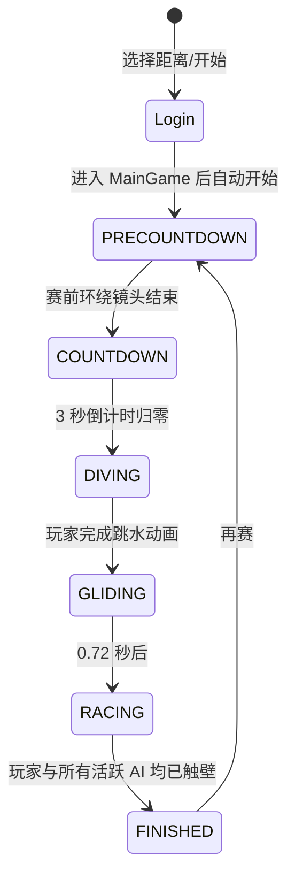
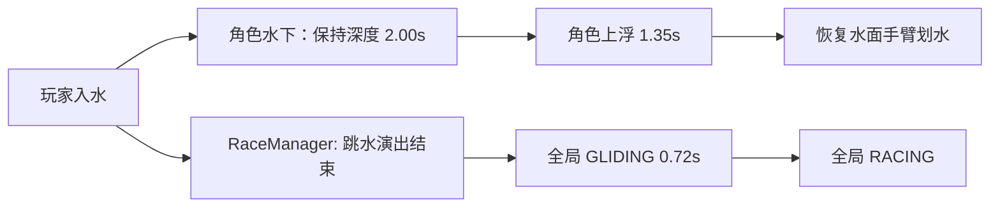

# 01｜产品概览与比赛流程

## 1. 对局构成

| 项目 | 当前实现 |
| --- | --- |
| 比赛模式 | 单人对 AI 的自由泳竞速 |
| 可选距离 | 50m、100m、200m；登录页可选，默认 100m |
| 泳池/折返 | 单池道长度 50m；100m 为一次折返，200m 为三次折返 |
| 泳道 | 8 条，每条 2.625 世界单位宽 |
| 参赛者 | 普通比赛：玩家 1 人 + AI 7 人；玩家为第 4 泳道（代码索引 3） |
| 特殊入口 | 100m AI 调试 1v1，可选 0.30 / 0.50 / 0.70 / 0.85 / 0.98 难度；模型调试仅供编辑器 |
| 胜负 | 玩家触壁且所有活跃对手均触壁后，按记录用时升序排名 |

起点与终点的世界坐标会从池场预制体校准；玩法距离仍以 50m 为一段处理。因此策划配置比赛距离时应只使用 50 的整数倍，当前入口已限制为 50/100/200。

## 2. 主流程

| 全局状态 | 玩家目标/允许输入 | 系统行为 |
| --- | --- | --- |
| `PRECOUNTDOWN` | 无比赛操作 | 镜头从广播位完成赛前环绕；镜头导演报告就绪后才真正开倒计时 |
| `COUNTDOWN` | 长按跳水蓄力；提前松开只取消蓄力 | 3、2、1；HUD 显示倒计时与蓄力条 |
| `DIVING` | 未蓄力则继续长按、松开提交跳水；已蓄力则倒计时结束自动提交 | AI 按各自反应时延起跳；玩家跳水动画完成前维持此状态 |
| `GLIDING` | 可输入踢腿/按住；角色层只按水下踢腿处理 | HUD 提示“滑行中”；固定 0.72 秒后切全局 `RACING` |
| `RACING` | 短按踢腿、长按后在甜区松开划水 | 计时、里程、实时名次、心率/体能更新、85% 触发冲刺阶段 |
| `FINISHED` | 再赛或回菜单 | 汇总排名、成绩、平均速度与节奏统计 |

## 3. 两套并行阶段（重要）

- 角色在水下保持及上浮期间（运行时合计约 3.35 秒）禁止手臂划水，输入会走踢腿链路。
- 全局 `RACING` 仅在入水后的 0.72 秒左右即开始，因此后续一段时间会出现“已开始计时、心率系统已开始更新、但人物仍不能划手”的组合。
- 水下额外阻力也跟随角色水下状态，而不是跟随全局 `GLIDING`。

这是当前实现事实，并不代表该时序已经是最终设计；是否保留请见待确认清单。

## 4. 跳水等待与计时边界

- 倒计时结束后，玩家可以不马上起跳；`DIVING` 没有超时强制提交。
- AI 不等待玩家，会在各自随机反应延迟后起跳并开始游动。
- 比赛计时从全局 `DIVING` 开始累积，包含玩家跳水动画、水下 `GLIDING` 与正式游泳；不包含倒计时和赛前镜头。
- AI 即便先游到终点，只有进入全局 `RACING` 后才会被 `RaceManager` 记录触壁时间。因此“玩家长期停在跳台”不是一个被规则明确处理的正式场景。

## 5. 赛程、折返与完成

- 里程是单调累加的总距离；每经过 50m，角色朝向与世界 X 方向翻转。
- 当前没有独立的触壁/转身操作、转身判定或转身损失。折返仅改变位置映射与角色朝向。
- 马达达到总赛程后停止，角色播放终点触壁/漂浮表现。
- 结算必须等待玩家和所有仍激活的 AI 都完成；结果面板显示完整榜单。

## 6. 代码依据

- 距离、折返：`assets/scripts/core/GameBalance.ts`（`RACE_DISTANCE_OPTIONS`、`raceDistanceToCourseX`）
- 状态与计时：`assets/scripts/core/RaceManager.ts`
- 流程、起跳与冲刺入口：`assets/scripts/app/GameFlowController.ts`
- 水下角色状态：`assets/scripts/entity/Swimmer.ts`
- 入口和模式：`assets/scripts/app/LoginManager.ts`

