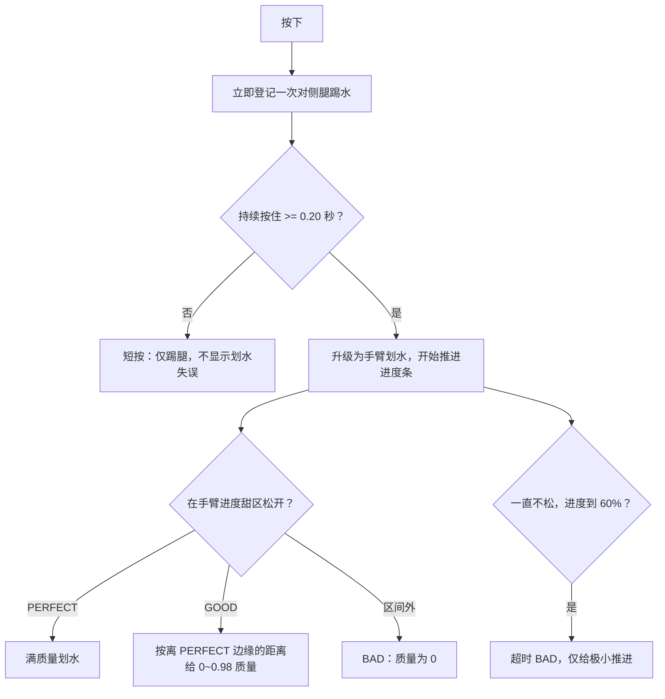

# 02｜输入与动作判定详规

## 1. 正式触控方案

比赛 HUD 的 `StrokeInput` 是唯一的划水触控入口。它的回调进入 `InputRouter.handleAutoPadStroke()`，自动把每一次新按下依次指定为左、右、左、右……；玩家不需要、也不应被要求选择左右手。

| 输入来源 | 行为 |
| --- | --- |
| 移动端 HUD 触控区 | 自动交替左右；按下开始、松开结束 |
| `S` 键 | 模拟一次移动端触控，自动交替 |
| `A` / 左方向键 | 显式左侧，编辑器/调试用途 |
| `D` / 右方向键 | 显式右侧，编辑器/调试用途 |
| 空格 / Enter | 在 `READY` 开始、在 `FINISHED` 再赛 |

运行时创建的 `InputManager` 已设置 `pointerInputEnabled = false`，因此该组件留下的“屏幕左右半区决定手侧”逻辑不是正式 HUD 路径。策划不应据此设计可见左右触控区。

## 2. 一次按压的判定流程

运行时覆盖后的关键阈值：

| 参数 | 运行时值 | 含义 |
| --- | ---: | --- |
| 升级为手臂的最短按住时间 | 0.20s | 小于此值的松开不会作为 BAD 结算 |
| GOOD 进度范围 | 0.15–0.60 | 进度是当前手臂一圈动作的比例 |
| PERFECT 进度范围 | 0.25–0.50 | 与 GOOD 重叠处按 PERFECT 优先 |
| 一直按住的超时点 | 0.60 | 到达后自动结算超时 BAD |
| 松开后动作追完速度 | 按住速度的 2.0 倍 | 不改变“松开那一刻”的评分，只影响动作收尾与脉冲时长 |

## 3. 甜区、评分与真实时间窗

评分轴不是“按住秒数”，而是手臂动作的**释放进度**。按住时动作按当前轮速推进；松开瞬间读取进度，随后动作以更快速度收尾。

| 释放位置 | 质量 `strokeQuality` | UI 评分 | 连击 |
| --- | ---: | --- | --- |
| 0.25–0.50 | 1.00 | PERFECT | +1 |
| 0.15–0.25 | 0 到 0.98，越接近 0.25 越高 | GOOD | 不变 |
| 0.50–0.60 | 0 到 0.98，越接近 0.50 越高 | GOOD | 不变 |
| 甜区外（且满足最短按住） | 0 | BAD | 清零 |
| 到 0.60 仍不松 | 0 | BAD（`timeout`） | 清零 |

手臂轮速会随当前速度线性上升，因此同一比例区间的实际秒数会变短：

| 当前速度带 | 运行时轮速 | 一整圈时长 | PERFECT 区理论宽度 |
| --- | ---: | ---: | ---: |
| `<= 1.0 m/s` | 0.5 圈/秒 | 2.00s | 0.50s |
| `1.0–3.0 m/s` | 线性上升 | 2.00s 到 0.50s | 同比例线性缩短 |
| `>= 3.0 m/s` | 2.0 圈/秒 | 0.50s | 0.125s |

最短按住 0.20s 同时生效。因此高速时，玩家必须在很窄的区间内同时满足“已按够 0.20s”和“尚未超过甜区”。这就是现行操作难度的主要来源。

## 4. 划水与踢腿各自做什么

### 短按踢腿

- 按下立即登记一次踢腿频率样本，并驱动**对侧腿**动作：左输入带右腿、右输入带左腿。
- 踢腿推进不是“每按一次固定加速”，而是当前点击频率 × 每 Hz 推进系数的连续加速。
- 频率用于推进时上限为 8Hz；动画测量安全上限 20Hz。接近踢腿封顶速度时推进会渐隐。
- 玩家停止输入后，频率会随静默时间下降，腿先收回中性姿势再静止。

### 长按划手

- 长按达到门槛后，会把同次按压从“单次踢腿”升级为对应侧手臂划水；该次起手踢腿动作不会被重复播放。
- 划水只能在同一侧当前动作已完成时再次接受；自动触控本身已左右交替。键盘显式左右输入可让两侧分别有进行中的动作，不能将“自动交替”误写成全局硬性禁令。
- 在角色水下状态下，手臂划水被禁用；按住升级后的划水请求会改走水下踢腿推进。

## 5. 评分、连击与反馈的真实效果

| 项目 | 已实现效果 | 未实现/不应假设的效果 |
| --- | --- | --- |
| PERFECT | 质量 1、额外划水推进、金色评分、人物完美闪光、连击 +1 | 没有连击速度叠加 |
| GOOD | 0–0.98 的连续质量、绿色评分、相应推进 | 不会增加连击 |
| BAD | 质量 0、红色评分、连击清零；但普通 BAD 仍会获得基础划水推进 | 没有额外失速/硬直 |
| 短按 | 踢腿，不展示 BAD | 不计入一次正式划水评分 |
| 超时 | 只给 `armStrokeTimeoutAccel` 的小推进 | 不走普通 BAD 的基础划水推进 |

`RHYTHM_BALANCE` 中存在“combo bonus”等旧字段，但当前马达不读取它们。结算页的最大连击、PERFECT/GOOD/BAD 次数均为统计/展示数据。

## 6. 水下输入差异

角色进入跳水水下姿态时：

- 同一触控入口仍可使用，短按照常产生频率型踢腿；
- 长按达到门槛后，`handleStroke()` 不启动手臂甜区，而是追加水下踢腿推进；
- 水下额外阻力同时存在，目的是让输入维持入水速度；
- 上浮结束前都不会出现正常手臂甜区。

## 7. 代码依据

- 输入分类及自动交替：`assets/scripts/core/InputRouter.ts`
- 运行时 HUD 触控绑定：`assets/scripts/ui/SpeedStarsUiPrefabBuilder.ts`
- 键盘/备用输入：`assets/scripts/core/InputManager.ts`
- 划水队列、释放进度、甜区与超时：`assets/scripts/swimmer/SwimmerMotor.ts`
- 实体对水下输入的改写：`assets/scripts/entity/Swimmer.ts`
- 现行覆盖值：`assets/resources/config/tuning.json`

